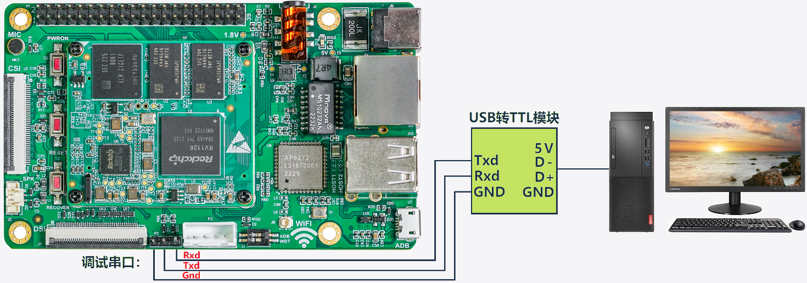
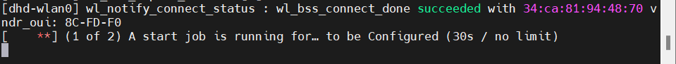
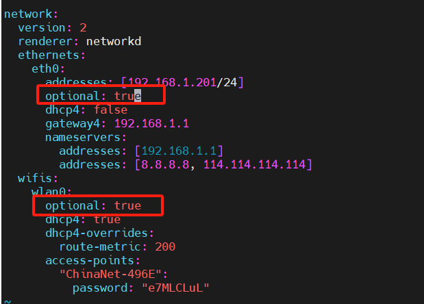

# 简介

## 主控芯片

瑞芯微RV1126芯片（CPU架构ARM v8）。

- 四核ARM Cortex-A7@1.5GHz

# 用户名密码

用户名：nano

密码：123456

# 硬件接口

**（11）协议串口**

​    EASY EAI Nano-T集成了一个协议串口，外界处理器可以通过该串口与EASY EAI Nano-T进行通信，接口形式为4Pin、2.54mm间距的插座，工位号为 P3。引脚描述如下表所示。

| **序号** | **信号描述** | **功能**      |
| -------- | ------------ | ------------- |
| 1        | 3.3V         | 系统3.3V电源  |
| 2        | UART5_TX     | 串口5发送引脚 |
| 3        | UART5_RX     | 串口5接收引脚 |
| 4        | GND          | 系统地        |

**（12）调试串口**

​    EASY EAI Nano -T的调试串口为 UART2，接口形式是 3Pin、2.54mm 间距的排针，工位号为 P1，引脚描述如下表所示。

| **序号** | **信号描述** | **功能**      |
| -------- | ------------ | ------------- |
| 1        | UART2_RX     | 串口2接收引脚 |
| 2        | UART2_TX     | 串口2发送引脚 |
| 3        | GND          | 系统地        |

## 串口调试



串口波特率1.5Mbps（即1500000）。


# 问题和解决

## 因网络连接导致启动慢

如果配置了有线或无线连接，若启动时没有连接网络，则会等很久



在`/etc/netplan/99_config.yaml`配置中，一定要增加`option: ture`，该配置项表示该网卡的配置是可选的，而不是强制性的。



# ROS2

参考：

[ROS2安装(armhf篇)_armhf ros2-CSDN博客](https://blog.csdn.net/weixin_42182822/article/details/132366613)

[Compile Ros2 Humble for Raspberry Pi Zero W - CineNeural](https://blog.cineneural.com/zh-cn/blog/2023-07/compile-ros2-humbl-for-raspberry-pi-zero-w/)


## 环境

CPU：armhf（armv7l）

OS：Ubuntu20.04

## 更换镜像源（可选）

### 更换Ubuntu镜像源

这里我们先做下文件备份

```bash
mv /etc/apt/sources.list /etc/apt/sources.list.bak
vim /etc/apt/sources.list
```

然后替换为华为云

```bash
deb https://repo.huaweicloud.com/ubuntu-ports/ focal main restricted universe multiverse
deb https://repo.huaweicloud.com/ubuntu-ports/ focal-updates main restricted universe multiverse
deb https://repo.huaweicloud.com/ubuntu-ports/ focal-backports main restricted universe multiverse
deb https://repo.huaweicloud.com/ubuntu-ports/ focal-security main restricted universe multiverse
```

### 更换PIP源

加快python第三方软件包安装速度

```bash
pip3 config set global.index-url https://pypi.tuna.tsinghua.edu.cn/simple
pip3 config set global.trusted-host https://pypi.tuna.tsinghua.edu.cn
```

## 设置local

```bash
sudo apt update && sudo apt install locales
sudo locale-gen en_US en_US.UTF-8
sudo update-locale LC_ALL=en_US.UTF-8 LANG=en_US.UTF-8
export LANG=en_US.UTF-8
locale  # verify settings
```

## 设置ROS源

确保启用universe存储库

```bash
sudo apt install software-properties-common
sudo add-apt-repository universe
```

添加ROS2 GPG密钥

```bash
sudo apt update && sudo apt install curl -y
sudo curl -sSL https://raw.githubusercontent.com/ros/rosdistro/master/ros.key -o /usr/share/keyrings/ros-archive-keyring.gpg
```

> 注意：为了避免DNS解析失败，可以通过修改/etc/hosts，添加如下域名信息：
>
> ```bash
> 185.199.108.133 raw.githubusercontent.com  
> ```

添加存储库到 sources list

```bash
echo "deb [arch=$(dpkg --print-architecture) signed-by=/usr/share/keyrings/ros-archive-keyring.gpg] http://packages.ros.org/ros2/ubuntu $(. /etc/os-release && echo $UBUNTU_CODENAME) main" | sudo tee /etc/apt/sources.list.d/ros2.list > /dev/null
```

>注意：由于是在国内如果上面默认ROS源无法连接就使用阿里源：
>
>```bash
>echo "deb [arch=$(dpkg --print-architecture) signed-by=/usr/share/keyrings/ros-archive-keyring.gpg] https://mirrors.aliyun.com/ros2/ubuntu/ $(. /etc/os-release && echo $UBUNTU_CODENAME) main" | sudo tee /etc/apt/sources.list.d/ros2.list > /dev/null
>
>$ sudo apt install curl gnupg2
>$ curl -s https://raw.githubusercontent.com/ros/rosdistro/master/ros.asc | sudo apt-key add -
>
>$ sudo apt update
>```

## 更新apt

```bash
sudo apt-get update
sudo apt-get upgrade
```

## 安装编译工具

```shell
sudo apt update && sudo apt install -y \
  libbullet-dev \
  python3-pip \
  python3-pytest-cov \
  ros-dev-tools

python3 -m pip install -U \
  argcomplete \
  flake8-blind-except \
  flake8-builtins \
  flake8-class-newline \
  flake8-comprehensions \
  flake8-deprecated \
  flake8-docstrings \
  flake8-import-order \
  flake8-quotes \
  pytest-repeat \
  pytest-rerunfailures \
  pytest -i https://pypi.org/simple
  
# install Fast-RTPS dependencies
sudo apt install --no-install-recommends -y \
  libasio-dev \
  libtinyxml2-dev
# install Cyclone DDS dependencies
sudo apt install --no-install-recommends -y \
  libcunit1-dev
```

## 获取ROS2源码

更改git代理

```bash
# 永久代理设置：
git config --global http.proxy http://git.iizone.com.cn:32222
git config --global https.proxy http://git.iizone.com.cn:32222
```

> 如果后续需要取消代理：
>
> ```bash
> # 取消设置的代理：
> git config --global --unset http.proxy
> git config --global --unset https.proxy
> ```

解决Git操作中的SSL证书问题：

```bash
# 方式一（推荐），在Git中关闭证书验证：
git config --global http.sslverify false
# 方式二，在Linux系统中关闭系统级证书验证：
export GIT_SSL_NO_VERIFY=1
```

下载源码

```bash
mkdir -p ~/ros2_foxy/src
cd ~/ros2_foxy
wget https://raw.githubusercontent.com/ros2/ros2/foxy/ros2.repos --no-check-certificate
vcs import --input ./ros2.repos src

```

> 这里ros2.repos内是各仓库的github地址。
>
> 由于github下载不稳定，如果上面代理不再有效，可自行修改ros2.repos文件，在仓库链接签名添加代理前缀 https://ghproxy.com/试试。


如果提示Fast-DDS无法找到的tag，修改下安装版本：

```bash
  eProsima/Fast-DDS:
    type: git
    url: https://github.com/eProsima/Fast-DDS.git
    #version: 2.1.x  
    #上一行改为
    version: 2.1.2
```


有几个没下载好

```
=== src/eProsima/Fast-CDR (git) ===
Cloning into '.'...
Note: switching to 'v1.0.13'.

You are in 'detached HEAD' state. You can look around, make experimental
changes and commit them, and you can discard any commits you make in this
state without impacting any branches by switching back to a branch.

If you want to create a new branch to retain commits you create, you may
do so (now or later) by using -c with the switch command. Example:

  git switch -c <new-branch-name>

Or undo this operation with:

  git switch -

Turn off this advice by setting config variable advice.detachedHead to false

HEAD is now at 174f6ff Bump version to 1.0.13 (#70)
=== src/eProsima/Fast-DDS (git) ===
Could not clone repository 'https://github.com/eProsima/Fast-DDS.git': Cloning into '.'...
fatal: the remote end hung up unexpectedly
fatal: early EOF
fatal: index-pack failed
=== src/eProsima/foonathan_memory_vendor (git) ===

```


不要编译一些不用的包。毕竟在开发板上运行，不需要GUI界面。

```bash
# don't build this unnecessary packages

touch src/ros-visualization/COLCON_IGNORE
touch src/ros/ros_tutorials/turtlesim/COLCON_IGNORE
touch src/ros2/demos/image_tools/COLCON_IGNORE
touch src/ros2/demos/intra_process_demo/COLCON_IGNORE
touch src/ros2/rviz/COLCON_IGNORE
```


不要安装

```bash
qt_gui_cpp 
```


## 使用Rosdep安装依赖

配置Rosdep。

通过修改hosts，添加DNS地址。首先在https://www.ipaddress.com/website/raw.githubusercontent.com/上查找`https://raw.githubusercontent.com`的IP地址，然后编辑`/etc/hosts`文件增加如下：

```bash
185.199.108.133   https://raw.githubusercontent.com
```

初始化

```bash
sudo apt upgrade
sudo pip install -U rosdep

sudo rosdep init
rosdep update
```

对下载后的ROS2软件包进行依赖性判断并将相关依赖软件包进行下载

```bash
rosdep install --from-paths src --ignore-src -y --skip-keys "fastcdr rti-connext-dds-5.3.1 urdfdom_headers"
```

> 上面这步比较耗时。


```bash
nano@EASY-EAI-NANO:~$ sudo rosdep init
Wrote /etc/ros/rosdep/sources.list.d/20-default.list
Recommended: please run

        rosdep update

nano@EASY-EAI-NANO:~$ rosdep update
reading in sources list data from /etc/ros/rosdep/sources.list.d
Hit https://raw.githubusercontent.com/ros/rosdistro/master/rosdep/osx-homebrew.yaml
Hit https://raw.githubusercontent.com/ros/rosdistro/master/rosdep/base.yaml
Hit https://raw.githubusercontent.com/ros/rosdistro/master/rosdep/python.yaml
Hit https://raw.githubusercontent.com/ros/rosdistro/master/rosdep/ruby.yaml
Hit https://raw.githubusercontent.com/ros/rosdistro/master/releases/fuerte.yaml
Query rosdistro index https://raw.githubusercontent.com/ros/rosdistro/master/index-v4.yaml
Skip end-of-life distro "ardent"
Skip end-of-life distro "bouncy"
Skip end-of-life distro "crystal"
Skip end-of-life distro "dashing"
Skip end-of-life distro "eloquent"
Skip end-of-life distro "foxy"
Skip end-of-life distro "galactic"
Skip end-of-life distro "groovy"
Add distro "humble"
Skip end-of-life distro "hydro"
Skip end-of-life distro "indigo"
Add distro "iron"
Skip end-of-life distro "jade"
Add distro "jazzy"
Skip end-of-life distro "kinetic"
Skip end-of-life distro "lunar"
Skip end-of-life distro "melodic"
Add distro "noetic"
Add distro "rolling"
updated cache in /home/nano/.ros/rosdep/sources.cache

```


## 编译ROS2源码

```bash
cd ~/ros2_foxy/
colcon build --symlink-install
```

## 设置环境变量

```bash
. ~/ros2_foxy/install/local_setup.bash

```

## 测试

```bash
## 运行talker
. ~/ros2_foxy/install/local_setup.bash
ros2 run demo_nodes_cpp talker

## 新起另一个终端，运行listener
. ~/ros2_foxy/install/local_setup.bash
ros2 run demo_nodes_py listener

```


# docker

## 安装

```bash
# 更新软件包
sudo apt-get update
sudo apt-get upgrade

# 安装依赖
sudo apt-get install ca-certificates curl gnupg lsb-release

# 添加docker密钥
curl -fsSL http://mirrors.aliyun.com/docker-ce/linux/ubuntu/gpg | sudo apt-key add -

# 添加阿里云docker软件源（这里注意nano开发板系统架构为armhf，不是arm64）
sudo add-apt-repository "deb [arch=armhf] http://mirrors.aliyun.com/docker-ce/linux/ubuntu $(lsb_release -cs) stable"

# 安装docker
sudo apt-get install docker-ce docker-ce-cli containerd.io

```


配置用户组(非必须操作，此操作目的是为了以后执行docker命令时无需输入sudo密码，避免这些重复操作而已。)

```bash
sudo usermod -aG docker $USER

$ sudo groupadd docker
$ sudo gpasswd -a $USER docker
$ newgrp docker
sudo reboot
```


检验docker是否安装成功

```bash
systemctl start docker
sudo apt-get -y install apt-transport-https ca-certificates curl software-properties-common
service docker restart
sudo docker run hello-world
```


查看版本

```bash
sudo docker version
```


## 查看docker是否在运行

```bash
systemctl status docker
```

