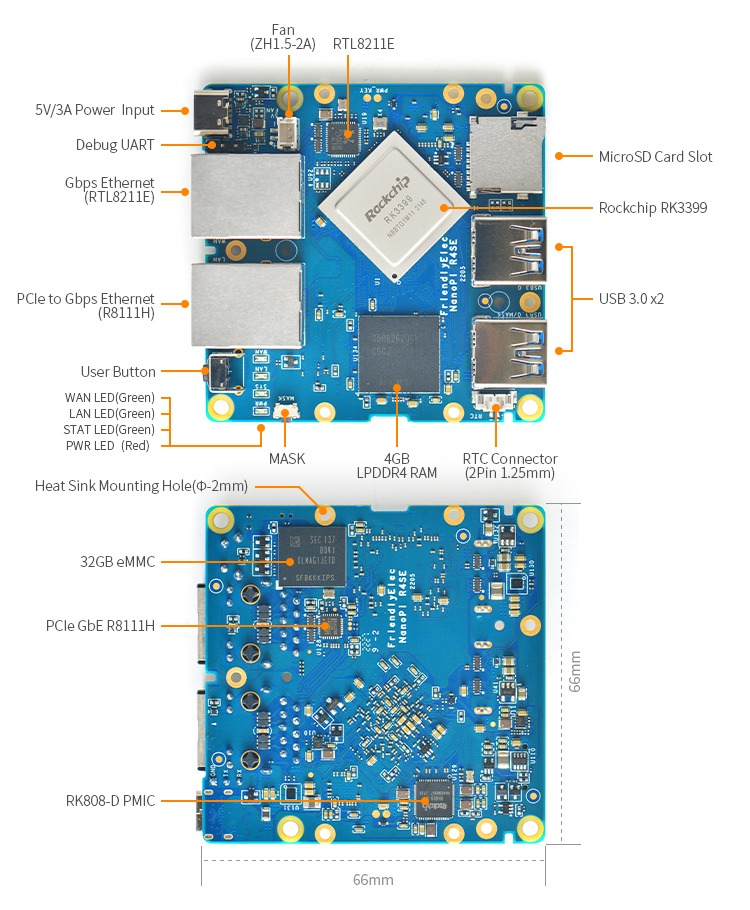
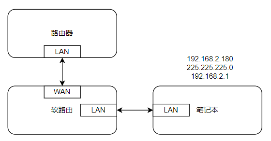
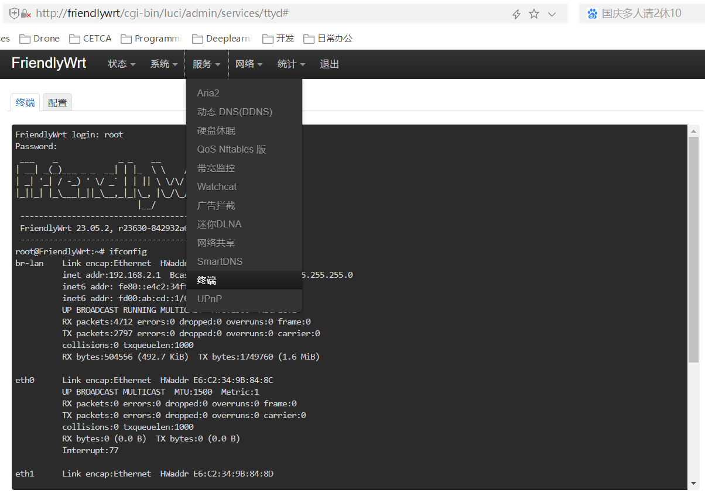
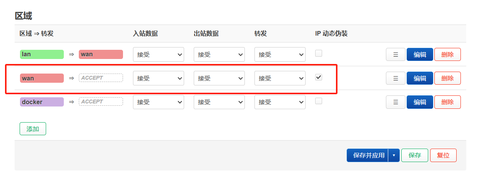
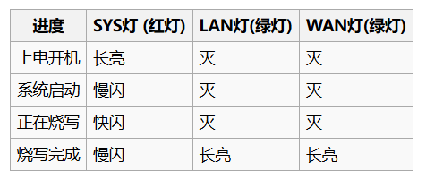
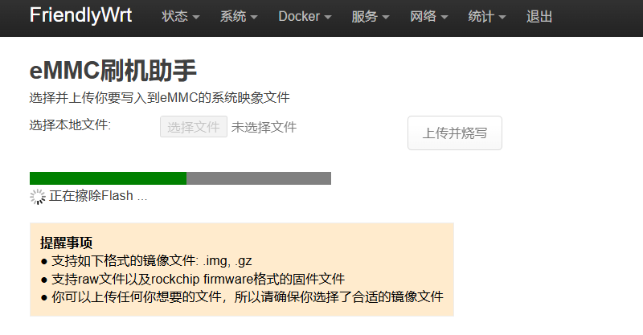
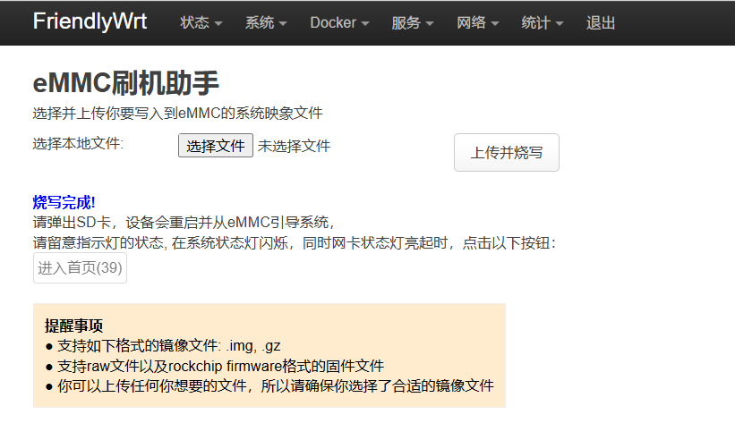
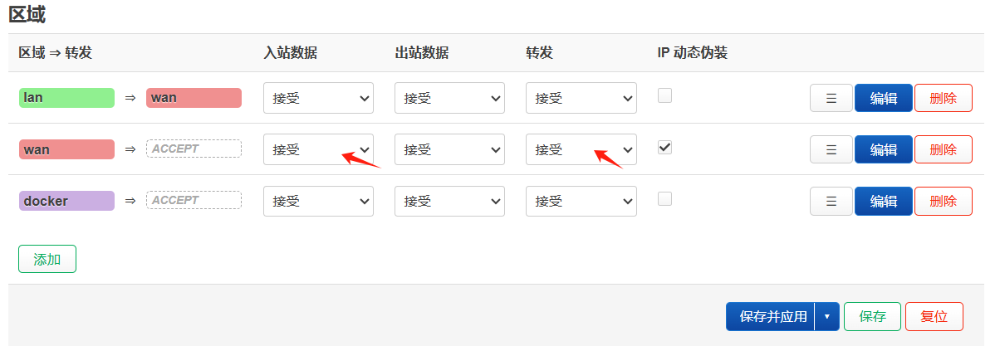

# 简介

## 参考网站

官网：[NanoPi R4SE/zh - FriendlyELEC WiKi](https://wiki.friendlyelec.com/wiki/index.php/NanoPi_R4SE/zh)

## 资源特性

- SoC: Rockchip RK3399
  - CPU: big.LITTLE，Dual-Core Cortex-A72(up to 2.0GHz) + Quad-Core Cortex-A53(up to 1.5GHz)
  - GPU: Mali-T864 GPU，supports OpenGL ES1.1/2.0/3.0/3.1, OpenCL, DX11, and AFBC
  - VPU: 4K VP9 and 4K 10bits H265/H264 60fps decoding, Dual VOP, etc
- **CPU架构：arm64v8**
- PMU: RK808-D PMIC, cooperated with independent DC/DC, enabling DVFS, software power-down, RTC wake-up, system sleep mode
- RAM: 4GB LPDDR4
- Flash: 32GB eMMC
- Ethernet: one Native Gigabit Ethernet, and one PCIe Gigabit Ethernet
- USB: two USB 3.0 Type-A ports
- microSD Slot x 1
- Debug: one Debug UART, 3 Pin 2.54mm header, 3V level, 1500000bps
- LEDs: 1 x power LED and 3 x GPIO Controlled LED (SYS, LAN, WAN)
- others:
  - 2 Pin 1.27/1.25mm RTC battery input connector
  - one User Button
  - one MASK Button for eMMC upgrade
  - one 5V Fan connector
- Power supply: DC 5V/3A, via USB-C connector
- PCB: 8 Layer, 66 mm x 66 mm
- Temperature measuring range: 0℃ to 80℃

## 结构

产品底部有四个螺丝孔（黑色垫片封住了），可以进行拆卸。

### 尺寸

## 电气

### 电路板布局



### 调试串口

开发板提供了一路调试串口（UART2），3V电平, 波特率为1500000bps，在板子背面有引脚定义。

| 引脚 | 定义        | 描述             |
| ---- | ----------- | ---------------- |
| 1    | GND         | 0V，靠近板子边缘 |
| 2    | UART2DBG_TX | output           |
| 3    | UART2DBG_RX | intput           |


# 如何使用

## 首次开机

开发板默认安装的是FriendlyWrt 23.05.2系统。

### 参考

http://wiki.friendlyelec.com/wiki/index.php/NanoPi_R4SE/zh#.E6.96.B9.E6.B3.953:_.E9.80.9A.E8.BF.87USB.E7.83.A7.E5.86.99

### 帐户与密码

默认用户名：root

默认密码是：password(某些版本是空密码）

### 系统版本

默认安装的系统为FriendlyWrt：

```bash
root@FriendlyWrt:~# uname -a
Linux FriendlyWrt 6.1.63 #1 SMP Fri Dec 22 16:33:59 CST 2023 aarch64 GNU/Linux
```


### 网络连接

推荐进行如下连接设置：



1. 开发板上电，开发板WAN连接交换机/路由器LAN，WAN默认设置的是协议为DHCP客户端；
2. 准备一个笔记本，连接开发板LAN，开发板的LAN默认IP为192.168.2.1，故将笔记本IP地址设置为192.168.2.xxx/255.255.255.0，网关为192.168.2.1；笔记本就可以上网了。
3. 在电脑浏览器上输入以下网址即可进入FriendlyWrt管理页面:
   - [http://friendlywrt/](http://friendlywrt/)
   - http://192.168.2.1/

### 系统版本

默认安装的系统版本是：FriendlyWrt 23.05.2, r23630-842932a63d

### 网页终端




### 防火墙设置

​        在调试时为了让笔记本等设备能够通过网络连接开发板，需要进入开发板网页并设置防火墙如下：



# 安装系统

## 通过TF卡运行系统

开发板默认上电会从TF卡启动，如果TF卡不存在，那么就会从eMMC启动。

访问[此处的下载地址](http://download.friendlyelec.com/NanoPiR4SE)下载需要的固件文件(位于`01_系统固件/01_SD卡固件`目录)和烧写工具(位于`05_工具软件`目录)：

详细操作步骤如下：

- 准备一张8G或以上容量的TF卡;
- 下载并解压镜像文件 xxx.img.gz 和工具 win32diskimager;
- 在Windows下以管理员身份运行 win32diskimager，在界面上选择你的SD卡盘符，选择解压后的固件文件，点击 Write 按钮烧写到SD卡; 或者在 Linux下使用 dd 命令将 rkXXXX-sd-OSNAME-YYYYMMDD.img 写入 SD卡;
- 将SD卡从电脑端弹出，插入NanoPi-R4SE的microSD卡槽;
- 连接NanoPi-R4SE的电源，系统会从TF卡启动;

这里我们下载的是`rk3399-sd-friendlywrt-23.05-docker-20231223.img.gz`。

## 安装至eMMC

### 方式一：用TF启动卡进行自动烧写（

  此方法是通过SD卡启动一个小型的Linux系统, 然后自动运行一个名为EFlasher的工具来将固件烧写到eMMC中。通过LED灯来掌握烧写进度。

访问[此处的下载地址](http://download.friendlyelec.com/NanoPiR4SE)下载需要的固件文件(位于`01_系统固件/02_SD卡刷机固件(SD-to-eMMC)`目录)和烧写工具(位于`05_工具软件`目录)：

详细操作步骤如下：

- 准备一张8G或以上容量的SDHC卡;
- 下载并解压 固件文件rk3399-eflasher-friendlywrt-23.05-docker-20231223.img.gz 和 工具win32diskimager;
- 在Windows下以管理员身份运行 win32diskimager，在界面上选择你的SD卡盘符，选择解压后的[EFlasher](https://wiki.friendlyelec.com/wiki/index.php/EFlasher/zh)固件，点击 Write 按钮烧写到SD卡; 或者在 Linux下使用 dd 命令将 rk3399-eflasher-OSNAME-YYYYMMDD.img 写入 SD卡;
- 将SD卡从电脑端弹出，插入NanoPi-R4SE的microSD卡槽;
- 连接NanoPi-R4SE的电源，系统会从SD卡启动，并自动启动 [EFlasher](https://wiki.friendlyelec.com/wiki/index.php/EFlasher/zh) 烧写工具将系统安装到 eMMC, 可以通过板载 LED 灯来了解安装进度:

- 烧写完成后，切断电源，然后从NanoPi-R4SE端弹出SD卡，重新上电开机，NanoPi-R4SE会从eMMC启动你刚刚烧写的系统;




### 方式二：通过网页烧写（暂时未成功）

使用烧写了FriendlyWrt固件的TF卡启动NanoPi-R4SE（也就是首先需要完成[通过TF卡运行系统]()部分）, 登录FriendlyWrt页面, 在网页菜单上点击 "系统" -> "eMMC刷机助手" 进入eMMC刷机助手界面, 点击界面上的 "选择文件" 按钮, 选择你要刷写的文件 (官方固件以rk3399-sd开头), 亦可选择第三方固件, 文件支持 .gz 格式的压缩文件, 或者以 .img 作为扩展名的raw格式。

同样使用`rk3399-sd-friendlywrt-23.05-docker-20231223.img.gz`。

上传后会存在SD卡系统根目录

```bash
FriendlyWrt login: root
Password: 
 ___    _             _ _    __      __   _
| __| _(_)___ _ _  __| | |_  \ \    / / _| |_
| _| '_| / -_) ' \/ _` | | || \ \/\/ / '_|  _|
|_||_| |_\___|_||_\__,_|_|\_, |\_/\_/|_|  \__|
                          |__/
 -----------------------------------------------------
 FriendlyWrt 23.05.2, r23630-842932a63d
 -----------------------------------------------------
root@FriendlyWrt:~# ls
setup.sh  upload
root@FriendlyWrt:~# ls upload/
rk3399-sd-friendlywrt-23.05-docker-20231223.img
root@FriendlyWrt:~# 
```

上传后会准备Flash擦写工作。



烧写完成后会提示烧写完成，这时可以弹出SD卡设备会从eMMC启动系统。

**一定注意不要下电再弹出SD卡。**



## 各系统烧写后的配置工作

### SD-2-emmc：Ubuntu

系统烧写完后，默认没有配置IP地址，需要打开外壳连接调试串口，并在测试笔记本打开串口调试终端（波特率1500000）。系统启动后，**用户名：pi、密码：pi**。

#### 增加网络配置

输入命令编辑网络配置文件。

```bash
pi@NanoPi-R4SE:~$ sudo vi /etc/netplan/50-cloud-init.yaml
```

添加如下内容：

```yaml
network:
    version: 2
    ethernets:
        eth1:
            addresses: [192.168.1.151/24]
            dhcp4: false
            optional: true
            gateway4: 192.168.1.1
            nameservers:
                addresses: [192.168.1.1]
                addresses: [8.8.8.8, 114.114.114.114]
```


#### 安装dockers

```bash
sudo apt install libseccomp-dev
```


## 修改

安装系统后，有可能会把LAN的IP改为192.168.2.2。

> 注意：最新的docker版本27.4.1不行。
>
> 后面从19.03版本尝试下。

# 复制系统

## 参考

在官网资料[NanoPi R4SE/zh - FriendlyELEC WiKi](https://wiki.friendlyelec.com/wiki/index.php/NanoPi_R4SE/zh#.E5.A4.87.E4.BB.BD.E6.96.87.E4.BB.B6.E7.B3.BB.E7.BB.9F.E5.B9.B6.E5.88.9B.E5.BB.BASD.E6.98.A0.E5.83.8F.28.E5.B0.86.E7.B3.BB.E7.BB.9F.E5.8F.8A.E5.BA.94.E7.94.A8.E5.A4.8D.E5.88.B6.E5.88.B0.E5.8F.A6.E4.B8.80.E5.9D.97.E5.BC.80.E5.8F.91.E6.9D.BF.29)进行了简单说明，详细需要参考官方提供的[sd-fuse_rk3399](https://github.com/friendlyarm/sd-fuse_rk3399)仓库内的文档说明。

## 说明

这里将详细讲解如何将系统复制到SD卡并通过SD卡烧写至eMMC。

这里假设开发板运行的是Ubuntu（例如烧写的是`02_SD卡刷机固件(SD-to-eMMC）/rk3399-eflasher-ubuntu-focal-desktop-4.19-arm64-20230915.img`）。

## 原理

一半我们拿到开发板后会使用官方提供的系统镜像烧写，然后进行一些开发和配置后，希望将系统重新打包成镜像文件并用于批量烧写。

一个完整的系统镜像包括uboot.img、kernel.img、userdata.img、rootfs.img等，故将待复制的系统（用户开发和配置完成后的系统）的根目录制作为rootfs.img并替换官方的系统镜像内的rootfs.img并使用官方工具重新打包成一个完整的系统镜像。

## 环境工具

在运行Ubuntu20.04的计算机上进行。

## 复制系统

### 备份根文件系统

开发板上电，通过ssh或直接通过开发板调试串口进入命令行，在开发板上执行以下命令，备份整个文件系统（包括OS与数据)：  

```
sudo passwd root
su root
cd /
tar --warning=no-file-changed -cvpzf /rootfs.tar.gz \
    --exclude=/rootfs.tar.gz --exclude=/var/lib/docker/runtimes \
    --exclude=/etc/firstuse --exclude=/etc/friendlyelec-release \
    --exclude=/usr/local/first_boot_flag --one-file-system /
```

注：备份时，如果系统中有挂载目录，最后会出现一个错误提示信息，可以无视它，我们本来就是要忽略这些目录。

这里生成的就是`rootfs.tar.gz`。

### 从根文件系统制作一个可启动的SD卡

1. 下载`sd-fuse_rk3399`仓库到本地（装有ubuntu的笔记本或WSL2都可以），后续都将在仓库文件夹下操作。然后下载并解压[分区镜像压缩包](http://112.124.9.243/dvdfiles/rk3399/images-for-eflasher)：

```
$ git clone https://github.com/friendlyarm/sd-fuse_rk3399 -b master --single-branch sd-fuse_rk3399-kernel4.4
$ cd sd-fuse_rk3399-kernel4.4
$ wget http://112.124.9.243/dvdfiles/rk3399/images-for-eflasher/ubuntu-focal-desktop-arm64-images.tgz
$ tar xvzf ubuntu-focal-desktop-arm64-images.tgz
```

2. 解压上一章节中从开发板上导出的rootfs.tar.gz, 这一步非常耗时。需要使用root权限, 因此解压命令需要加上sudo:

```
$ mkdir ubuntu-focal-desktop-arm64/rootfs
$ sudo ./tools/extract-rootfs-tar.sh rootfs.tar.gz ubuntu-focal-desktop-arm64/rootfs
```

3. 用以下命令将文件系统目录打包成 rootfs.img:

```
sudo ./build-rootfs-img.sh ubuntu-focal-desktop-arm64/rootfs ubuntu-focal-desktop-arm64
```

4. 生成SD-to-eMMC卡刷固件:

```
./mk-emmc-image.sh ubuntu-focal-desktop-arm64 autostart=yes
```

5. 如果文件过大导致无法打包，可以使用RAW_SIZE_MB环境变量重新指定固件大小，比如指定为16g:

```
$ RAW_SIZE_MB=16000 ./mk-emmc-image.sh ubuntu-focal-desktop-arm64 autostart=yes
```

> 如果要打包为SD卡镜像则替换第4步和第5步：
>
> ```bash
> # 替换第4步
> $ ./mk-sd-image.sh ubuntu-focal-desktop-arm64
> # 替换第5步
> $ RAW_SIZE_MB=16000 ./mk-sd-image.sh ubuntu-focal-desktop-arm64
> ```

6. 命令执行成功后, 将生成以下文件, 此文件可烧写到SD卡运行:  

```
out/rk3399-eflasher-friendlydesktop-4.4-arm64-YYYYMMDD.img
```

### 常见问题

如果出现`bad interpreter: No such file or directory`错误，可能是脚本sh文件格式不是unix，可以使用如下命令转换：

```bash
dos2unix ./tools/*.sh ./*.sh
```

# docker使用

## friendlywrt

```bash
# 创建并启动容器并以host网络模式启动。
docker run --name="cetcs" -it --net=host ubuntu20:04 /bin/bash
docker run --name="drone" -it --net=host -v /root/Desktop:/home/Desktop ubuntu20:04 /bin/bash
# 启动容器
docker start -a cetcs
# 安装软件
# 备份镜像
docker commit -m "drone develop" -a="xueyk" ba2d4c drone_python3:v1
docker save -o /root/Desktop/drone_python3.tar drone_python3:v1
docker load -i /root/Desktop/drone_python3.tar

```

# 问题和解决

## 无法上网

### 防火墙问题

尝试1：设置为接受。




尝试2：关闭IPV6

```bash
. /root/setup.sh
disable_ipv6
reboot
```

待NanoPi-R4SE重启完毕，电脑也需要重新插拨一下网线（或重启网络端口）以便重新获得IP地址。


```bash
 * opkg_download: Failed to download https://mirrors.cloud.tencent.com/openwrt/releases/23.05.2/packages/aarch64_generic/telephony/Packages.gz, wget returned 4.
 * opkg_download: Check your network settings and connectivity.

```


登录到路由器，并编辑 `/etc/opkg/distfeeds.conf` 文件，将其中的 `http://downloads.openwrt.org` 替换为

```
https://mirrors.tuna.tsinghua.edu.cn/openwrt
```

即可。

```bash
src/gz openwrt_base https://mirrors.tuna.tsinghua.edu.cn/openwrt/releases/23.05.2/packages/  aarch64_generic/base

```

