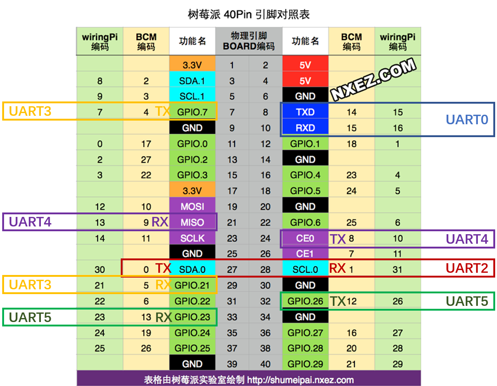

# 树莓派安装Ubuntu系统

## 系统安装与配置

### 系统下载

由于官网只提供了最新版本的下载，如果希望下载旧版本，那么可以去网站：http://old-releases.ubuntu.com/releases/下载，例如下载树莓派4对应的ubunt18.04.4 版本则可以打开网页中显示的相应文件夹即可：http://old-releases.ubuntu.com/releases/18.04.4/。

你会发现即使是ubuntu18.04版本仍然分了很多小版本，他们的名字代表的含义如下：

- server: 体积小，没有桌面
- armhf: 32-bit
- arm64: 64-bit

注意：

1、树莓派4有4GB内存版本和8GB内存版本，其中4GB内存版本只能安装32bit系统，即armhf版本，而8GB内存版本可以安装64bit系统及arm64版本。

### 系统配置

#### 用户密码

对于server版本的系统，初次登录的Login和password都是ubuntu，登录上就要更改password，这里我统一修改为alex0610。

如果要更改密码：

```shell
$ passwd ubuntu   #其中ubuntu为用户名
输入当前密码，再输入新密码即可
```

#### 安装桌面

（1）更新系统
sudo apt-get update
sudo apt-get upgrade
（2）安装桌面环境（三个中任意选择：xubuntu-desktop、lubuntu-desktop、kubuntu-desktop）
sudo apt-get install xubuntu-desktop
（3）重启后进入系统

#### ssh配置

1. Ubuntu系统默认安装了openssh-client，可以直接在其他电脑上ssh远程登录树莓派的Ubuntu系统，如果希望启动本机ssh服务就需要安装openssh-server:

```
#查看当前是否安装ssh-server服务
$ dpkg -l | grep ssh
#安装ssh-server
$ sudo apt-get install openssh-server
```

2. 启动ssh-server

```
$ sudo /etc/init.d/ssh start
#或者
$ sudo service ssh start
```

查看是否启动成功

```
$ ps -e |grep ssh
```
#### 固定IP

使用ubuntu时注意，不同版本进行固定IP配置时修改的文件不一样。

- 16.04版及以前的Ubuntu DNS在 /etc/resolvconf/resolv.conf.d/base 文件中设置，然后再执行resolvconf -u。

- 18.04版ubuntu用netplan管理network, 在如 /etc/netplan/01-network-manager-ens33.yaml这样的文件中设置，然后再执行 sudo netplan apply

**1. Ubuntu16.04-Desktop版本**

终端输入**vi /etc/network/interfaces**命令编辑配置文件,增加如下内容： 

```
#loopback network interface
auto lo
iface lo inet loopback
#eth0为网卡名，有线网卡
auto eth0
iface eth0 inet static
address 192.168.1.211
netmask 255.255.255.0
gateway 192.168.1.1
dns-nameserver 8.8.8.8

#wlan0为网卡名,无线网卡
auto wlan0
iface wlan0 inet static
address 192.168.1.212
netmask 255.255.255.0
gateway 192.168.1.1
dns-nameserver 8.8.8.8
```

重启网络

```
ifconfig eth0 down
ifconfig eth0 up
```


终端输入**vi /etc/netplan/50-cloud-init.yaml**命令编辑配置文件,修改如下内容：

```
network:
    ethernets:
        eth0:
            addresses: [192.168.1.201/24]
            dhcp4: false
            gateway4: 192.168.1.1
            nameservers:
                addresses: [192.168.1.1]
                addresses: [8.8.8.8, 114.114.114.114]
```

注意，以上冒号后面必须加空格！

应用配置：`sudo netplan apply`.

**2. Ubuntu18.04-Server版本配置无线**

首先需要查看网卡名字，使用`ifconfig`查不到无线网卡，你需要用`ip a`或者`ip addr show`命令查看，如果网卡名称为`wlan0`那么同样在文件**vi /etc/netplan/50-cloud-init.yaml**中更改配置如下：

```shell
network:
   version: 2
   ethernets:
       eth0:
           dhcp4: true
           optional: true # 配置为可选，这样不会导致无网络时启动慢
           match:
               macaddress: b8:27:eb:c6:94:8f
           set-name: eth0
   wifis:
       wlan0:
           dhcp4: true # 配置为可选，这样不会导致无网络时启动慢
           access-points:
               "wifi的ssid":
                   password: "wifi密码"
### 或者配置如下（固定IP）
network:
    renderer: NetworkManager
    wifis:
        wls33:                        #网卡名称，根据`ip a`命令查到的来确定
            dhcp4: false
            addresses: [192.168.18.123/24]
            gateway4: 192.168.18.1
            nameservers:
                addresses:
                - 8.8.8.8
                - 8.8.4.4
                search: []
            access-points:
                "wifi_ssid":           #WiFi热点名称，根据实际配置
                    password: "12345"  #WiFi密码，根据实际配置  
    version: 2
###
network:
   ethernets:
       eth0:
           dhcp4: true
           optional: true
    version: 2
    wifis:
        wls33:                        #网卡名称，根据`ip a`命令查到的来确定
        	optional: true # 配置为可选，这样不会导致无网络时启动慢
            dhcp4: false
            addresses: [192.168.18.123/24]
            gateway4: 192.168.18.1
            nameservers:
                addresses:
                - 8.8.8.8
                - 8.8.4.4
                search: []
            access-points:
                "wifi_ssid":           #WiFi热点名称，根据实际配置
                    password: "12345"  #WiFi密码，根据实际配置  

```

配置完后进行：

```shell
sudo apt install wpasupplicant
sudo apt install network-manager
sudo netplan generate
sudo netplan apply

# 配置好文件之后 需要执行下面这个命令，查看配置是否有错，如果有错它会自动回滚上次正确配置
sudo netplan try
# 没错会让你按enter确认使用这些配置，然后执行这个命令来使配置生效
# 这个命令执行完重启后，需要等待配置完成，不要直接断电，耐心等一会。
sudo netplan apply
```

**2. Ubuntu18.04-Server版本配置有线和无线**

```shell
network:
    ethernets:
        eth0:
            addresses: [192.168.1.201/24]
            dhcp4: false
            optional: true  # 配置为可选，这样不会导致无网络时启动慢
            gateway4: 192.168.1.1
            nameservers:
                addresses: [192.168.1.1]
                addresses: [8.8.8.8, 114.114.114.114]
    wifis:
        wlan0:
            dhcp4: false
            optional: true  # 配置为可选，这样不会导致无网络时启动慢
            addresses: [192.168.43.101/24]
            gateway4: 192.168.43.1
            nameservers:
                addresses:
                - 8.8.8.8
                - 8.8.4.4
                search: []
            access-points:
                "alex":
                    password: "alex0610"
    version: 2
```


#### 开机自启动

首先进行配置文件修改，ssh-server配置文件位于/etc/ssh/sshd_config，在这里可以定义SSH的服务端口，默认端口是22，你可以自己定义成其他端口号，如222。把配置文件中的”PermitRootLogin without-password”加一个”#”号,把它注释掉，再增加一句”PermitRootLogin yes”。

开启ssh开机启动

```
$ sudo systemctl enable ssh
```


### 串口配置

- 查看串口驱动

```shell
$ ls /dev/ttyAMA*
/dev/ttyAMA0
```

- 查看所有可用串口

```shell
$ sudo apt install libraspberrypi-bin
$ dtoverlay -a | grep uart
  midi-uart0
  midi-uart1
  miniuart-bt
  uart0
  uart1
  uart2
  uart3
  uart4
  uart5
```


- 使能所有串口

运行命令`sudo vim /boot/firmware/usercfg.txt`，文件结尾添加如下内容：

```shell
dtoverlay=uart2
dtoverlay=uart3
dtoverlay=uart4
dtoverlay=uart5
```

重启后，可以再次查看当前可使用的串口驱动

```shell
$ ls /dev/ttyAMA*
/dev/ttyAMA0  /dev/ttyAMA1  /dev/ttyAMA2  /dev/ttyAMA3  /dev/ttyAMA4
```

- 串口引脚对照

```shell
UART0： GPIO14 = TXD0 -> ttyAMA0     GPIO15 = RXD0 -> ttyAMA0
UART1： ttyS0
UART2： GPIO0  = TXD2 -> ttyAMA1     GPIO1  = RXD2 -> ttyAMA1
UART3： GPIO4  = TXD3 -> ttyAMA2     GPIO5  = RXD3 -> ttyAMA2
UART4： GPIO8  = TXD4 -> ttyAMA3     GPIO9  = RXD4 -> ttyAMA3
UART5： GPIO12 = TXD5 -> ttyAMA4     GPIO13 = RXD5 -> ttyAMA4
```



## 命令总结

```
-----------------------------------------
#启动ssh服务
$ sudo /etc/init.d/ssh start
#关闭ssh服务
$ sudo /etc/init.d/ssh stop
#查看服务运行状态
$ sudo service sshd status
-----------------------------------------
#开机自动启动ssh命令
sudo systemctl enable ssh
#关闭ssh开机自动启动命令
sudo systemctl disable ssh
#单次开启ssh
sudo systemctl start ssh
#单次关闭ssh
sudo systemctl stop ssh
#查看ssh是否启动，看到Active: active (running)即表示成功
sudo systemctl status ssh
-----------------------------------------
```


## 问题

1. connection reset by (server_ip) port 22

解决方法：

```
rm /etc/ssh/ssh_host_*
sudo dpkg-reconfigure openssh-server
```


