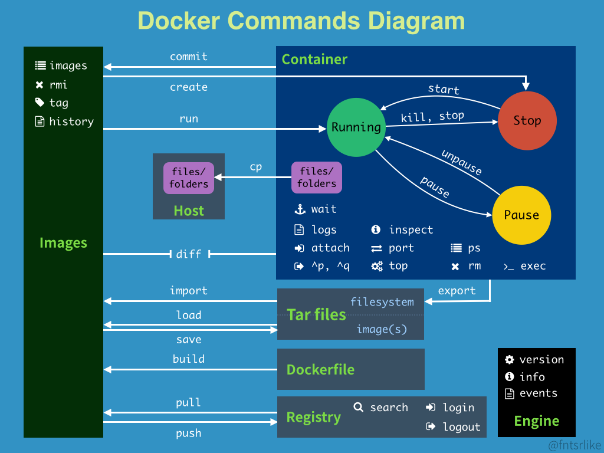

# Docker命令

## 命令示意图



## 帮助命令

```python
docker version              #显示docker版本信息
docker info                 #显示docker的系统信息，包括镜像和容器的数量
docker 命令 --help           #帮助命令
```

查看可选参数

```shell
docker run --help | grep <参数>
```


## 镜像命令

### 查看本地主机上的镜像

**命令：**docker images 

```bash
alex@alex_laptop:~$ docker images 
REPOSITORY    TAG       IMAGE ID       CREATED        SIZE
hello-world   latest    d1165f221234   4 months ago   13.3kB
# 解释
REPOSITORY 镜像的仓库源

# 可选项
Options:
  -a, --all             Show all images (default hides intermediate images)
      --digests         Show digests
  -f, --filter filter   Filter output based on conditions provided
      --format string   Pretty-print images using a Go template
      --no-trunc        Don't truncate output
  -q, --quiet           Only show image IDs

```

### 镜像搜索

**命令：**docker search 

```bash
alex@alex_laptop:~$ docker search hello-world
NAME                                       DESCRIPTION                                     STARS     OFFICIAL   AUTOMATED
hello-world                                Hello World! (an example of minimal Dockeriz…   1488      [OK]       
kitematic/hello-world-nginx                A light-weight nginx container that demonstr…   150                  
tutum/hello-world                          Image to test docker deployments. Has Apache…   83                   [OK]

# 设置搜索选项：根据收藏数搜索
alex@alex_laptop:~$ docker search hello-world -f stars=150
NAME                          DESCRIPTION                                     STARS     OFFICIAL   AUTOMATED
hello-world                   Hello World! (an example of minimal Dockeriz…   1488      [OK]       
kitematic/hello-world-nginx   A light-weight nginx container that demonstr…   150
```

### 下载镜像

**命令：**docker pull [OPTIONS] NAME[:TAG|@DIGEST]

```bash
###
alex@alex_laptop:~$ docker pull mysql
Using default tag: latest                 #如果不写TAG，默认就是latest
latest: Pulling from library/mysql
33847f680f63: Pull complete               #分层下载！分布式管理的核心，不同版本可共用某些层。
5cb67864e624: Pull complete 
1a2b594783f5: Pull complete 
b30e406dd925: Pull complete 
48901e306e4c: Pull complete 
603d2b7147fd: Pull complete 
802aa684c1c4: Pull complete 
715d3c143a06: Pull complete 
6978e1b7a511: Pull complete 
f0d78b0ac1be: Pull complete 
35a94d251ed1: Pull complete 
36f75719b1a9: Pull complete 
Digest: sha256:8b928a5117cf5c2238c7a09cd28c2e801ac98f91c3f8203a8938ae51f14700fd   #签名信息
Status: Downloaded newer image for mysql:latest   
docker.io/library/mysql:latest             #真实地址
#等价于
docker pull docker.io/library/mysql:latest
###
alex@alex_laptop:~$ docker pull mysql:5.7
5.7: Pulling from library/mysql
33847f680f63: Already exists              #共用层不再重复下载
5cb67864e624: Already exists 
1a2b594783f5: Already exists 
b30e406dd925: Already exists 
48901e306e4c: Already exists 
603d2b7147fd: Already exists 
802aa684c1c4: Already exists 
5b5a19178915: Pull complete 
f9ce7411c6e4: Pull complete 
f51f6977d9b2: Pull complete 
aeb6b16ce012: Pull complete 
Digest: sha256:be70d18aedc37927293e7947c8de41ae6490ecd4c79df1db40d1b5b5af7d9596
Status: Downloaded newer image for mysql:5.7
docker.io/library/mysql:5.7
```

手动指定镜像地址安装

```bash
docker pull docker.mirrors.ustc.edu.cn/library/mysql
```

### 移除镜像

**命令：**docker rmi

```bash
### 通过ID删除
alex@alex_laptop:~$ docker images
REPOSITORY    TAG       IMAGE ID       CREATED        SIZE
mysql         5.7       8cf625070931   10 days ago    448MB
mysql         latest    c60d96bd2b77   10 days ago    514MB
hello-world   latest    d1165f221234   4 months ago   13.3kB
alex@alex_laptop:~$ docker rmi 8cf625070931
Untagged: mysql:5.7
Untagged: mysql@sha256:be70d18aedc37927293e7947c8de41ae6490ecd4c79df1db40d1b5b5af7d9596
Deleted: sha256:8cf6250709314f2fcd2669e8643f5d3bdebfe715bddb63990c8c96e5d261d6fc
Deleted: sha256:452fe6896278c26338d547f8d1092011d923785247c46629b374d3477fe28c84
Deleted: sha256:bd40bf60af5d06e6b93eaf5a648393d97f70998faa3bfa1b85af55b5a270cb35
Deleted: sha256:c43e9e7d1e833650e0ed54be969d6410efa4e7fa6e27a236a44a2b97e412ee93
Deleted: sha256:70f18560bbf492ddb2eadbc511c58c4d01e51e8f5af237e3dbb319632f16335b
### 删除多个镜像
alex@alex_laptop:~$ docker rmi 镜像1ID 镜像2ID
### 删除所有镜像
#通过docker images -aq获取所有镜像的ID并作为参数传到rmi命令，实现删除全部
alex@alex_laptop:~$ docker rmi -f $(docker images -aq)
```


### 提交镜像

提交镜像是基于当前容器制作一个副本。

命令：docker commit -m="提交的描述信息" -a="作者" 容器id 目标镜像名:[TAG]

例如：

```shell
docker commit -m="drone develop" -a="alex" a404c6c174a2 drone:v1
```


## 容器命令

说明：有了镜像才可以创建容器

### 新建容器并启动

命令：

```shell
docker run [可选参数] image

# 参数说明
--name='name'     #容器名字
-d                #后台方式运行
-it               #使用交互方式运行， 进入容器查看内容
-p                #指定容器的端口 -p  8080:8080
	-p ip:主机端口:容器端口
	-p 主机端口:容器端口       #常用
	-p 容器端口
--restart         #容器的重启策略
    no    默认不重启
    always在容器退出时总是重启容器
--add-host        # --add-host=gitlab.com=192.168.1.20
```


```bash
### 新建容器并进入容器
alex@alex_laptop:~$ docker run -it tiryoh/ros2 /bin/bash

### 退出容器
ubuntu@4382276945a2:~$ exit
exit
alex@alex_laptop:~$ 
```

### 列出所有运行的容器

**命令：**docker ps

```shell
# docker ps
          #列出正在运行的容器
-a        #列出正在运行的容器+历史运行过的容器
-n=?      #列出最近创建的容器
-q        #只显示容器的编号
```


```shell
alex@alex_laptop:~$ docker ps -a
CONTAINER ID   IMAGE         COMMAND                  CREATED         STATUS                            PORTS     NAMES
4382276945a2   tiryoh/ros2   "/ros_entrypoint.sh …"   5 minutes ago   Exited (127) About a minute ago             vibrant_beaver
```

### 退出容器

```shell
exit       # 容器停车并退出
ctrl+P+Q   # 容器不停止退出，注意，是先按住ctrl和P再按Q
```

### 删除容器

```shell
docker rm 容器ID                      #删除指定容器，不能删除正在运行的容器，如果要强制删除 rm -f
docker rm -f $(docker ps -aq)        #删除所有容器
docker ps -a -q|xargs docker rm      #删除所有容器
```

### 启动/停止容器

```shell
docker start 容器ID           #启动容器
docker start -a 容器ID        #attach启动容器，进入终端
docker restart 容器ID         #重启容器
docker stop 容器ID            #停止当前正在运行的容器
docker kill 容器ID            #强制停止当前容器
```

### 后台启动容器

**命令：**docker run -d 镜像名

```shell
#问题docker ps，发现停止了
#常见的坑，docker容器使用后台运行，就必须要有一个前台进程，docker发现没有应用，就会自动停止。
```

### 在其他终端进入已经运行的容器

第一种方法：使用`docker attach`

```shell
$ sudo docker attach 775c7c9ee1e1

###
#可使用Ctrl+Q+P退出
```

>使用该命令有一个问题。当多个窗口同时使用该命令进入该容器时，所有的窗口都会同步显示。如果有一个窗口阻塞了，那么其他窗口也无法再进行操作。
> 因为这个原因，所以docker attach命令不太适合于生产环境，平时自己开发应用时可以使用该命令。

第二种方法：使用`docker exec`

```shell
$ sudo docker exec -it 775c7c9ee1e1 /bin/bash
```


## 常用其他命令

### 查看日志

```shell
# docker logs

# 查看最后十条日志
alex@alex_laptop:~$ docker logs -ft --tail 10 f0b7c5f703a1
```

### 查看容器中的进程信息

```shell
top命令

alex@alex_laptop:~$ docker top f0b7c5f703a1
UID                 PID                 PPID                C                   STIME               TTY                 TIME                CMD
alex                23984               23962               9                   20:24               pts/0               00:00:01            /bin/bash

```

### 查看镜像的元数据

```shell
docker inspect --help
```

### 进入当前正在运行的容器

```shell
### 方式一：
# 进入容器后开启新的终端
# 命令
docker exec -it 容器ID /bin/bash
#
alex@alex_laptop:~$ docker exec -it f0b7c5f703a1 /bin/bash

### 方式二：
# 进入容器当前正在执行的终端，不会启动新的进程
docker attach 容器ID
```

### 从容器拷贝文件到主机

**命令：**docker cp 容器ID:容器内路径  目的的主机路径

```shell
# 在容器内新建一个test文件夹
alex@alex_laptop:~$ docker attach f0b7c5f703a1
ubuntu@f0b7c5f703a1:~$ ls
ros2_setup_scripts_ubuntu
ubuntu@f0b7c5f703a1:~$ mkdir test
ubuntu@f0b7c5f703a1:~$ ls
ros2_setup_scripts_ubuntu  test
ubuntu@f0b7c5f703a1:~$ vi test/name.md
ubuntu@f0b7c5f703a1:~$ ls
ros2_setup_scripts_ubuntu  test
ubuntu@f0b7c5f703a1:~$ exit
# 执行拷贝，容器是否运行都不重要，只要容器在就可以拷贝
alex@alex_laptop:~$  cp f0b7c5f703a1:/home/ubuntu/test test
```


### 查看端口映射

```shell
$ docker port 容器ID  #或者 
$ docker port 容器名称
```

