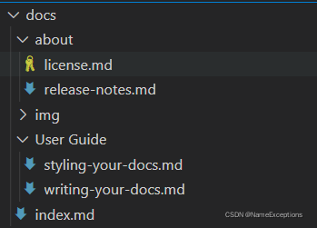

# MkDoc

mkdoc可以将一系列markdown文件生成静态网页。

官网：

https://www.mkdocs.org/getting-started/#building-the-site

说明文档：

https://markdown-docs-zh.readthedocs.io/zh_CN/latest/

## 下载安装

```shell
$ pip3 install -i https://pypi.tuna.tsinghua.edu.cn/simple  mkdocs
```

## 使用

### 创建工程

```shell
$ mkdocs new my-project
$ cd my-project
```

创建的目录结构为：

```shell
|-- mkdocs.yml
|-- docs/
    |-- index.md
```

### 编译

```shell
$ mkdocs build
```

### 启动服务

在工程目录下，启动mkdocs服务。

```shell
$ cd my-project
$ mkdocs serve
```

打开浏览器，输入http://127.0.0.1:8000/即可查看网页，文件内容修改会自动同步至网页中。

### 添加文档

编辑**mkdocs.yml**文件，在**nav**下，根据文件路径添加并给定一个导航项名称即可。

```shell
site_name: MkLorum
site_url: https://example.com/
nav:
    - Home: index.md              # Home是导航列表中的项，对应文件为index.md
    - About: about.md
```

### 主题设置

通过配置**theme**设置主题。

```shell
site_name: MkLorum
site_url: https://example.com/
nav:
    - Home: index.md
    - About: about.md
theme: readthedocs
```


## 各功能

### 多级导航

```shell
nav:
  - 主页: 'index.md'
  - User Guide:
    - Writing your docs: User Guide/writing-your-docs.md
    - Styling your docs: User Guide/styling-your-docs.md
  - About:
    - License: 'about/license.md'
    - Release Notes: 'about/release-notes.md'
```

文件目录如下图：



### 插入图片

将markdown文件与图片文件夹`imgs`放到同一层目录下，然后使用markdown正常语法插入图片即可。例如：

```shell

```

> 注意：
>
> 一定不要使用如下语法，无法正常加载图像。
>
> ```shell
> 
> ```

### 站内链接

链接同级目录文件

```shell
[要链接的文档1](link_file.md)
```

另外可以通过目录操作，链接其他目录下的文件

```shell
[要链接的文档2](../gitlab/gitlab.md)
```


## 问题和解决

### 网页访问慢的问题

问题描述：

生成的网站部署后，加载较慢，主要是因为site目标下的index .html需要联网下载两个文件。

解决：

1. 在工程路径下创建一个用于保存自定义主题的文件夹custom_theme

2. 将readthedocs主题拷贝过来

   其中该主题存放路径为/home/allex/.local/lib/python3.6/site-packages/mkdocs/themes/readthedocs

   ```shell
   $ cp -r /home/allex/.local/lib/python3.6/site-packages/mkdocs/themes/readthedocs/* /media/allex/Data/CETCA/B-研发部/website/main-page/custom_theme
   ```

3. 修改base.html

   下载https://cdnjs.cloudflare.com/ajax/libs/highlight.js/10.5.0/styles/github.min.css，并放到`custom_theme/css`路径下。

   将

   ```html
   <link rel="stylesheet" href="https://cdnjs.cloudflare.com/ajax/libs/highlight.js/10.5.0/styles/github.min.css" />
   ```

   修改为：

   ```html
   <link rel="stylesheet" href="css/github.min.css" />
   ```

   下载https://cdnjs.cloudflare.com/ajax/libs/highlight.js/10.5.0/highlight.min.js，并放到`custom_theme/js`路径下。


   将

   ```shell
   <script src="https://cdnjs.cloudflare.com/ajax/libs/highlight.js/10.5.0/highlight.min.js"></script>
   ```

   修改为：

   ```html
   <script src="js/highlight.min.js"></script>
   ```

4.  修改mkdocs.yml文件

   增加自定义主题

   ```yml
   theme: 
       name: readthedocs
       custom_dir: custom_theme/
   ```

   


