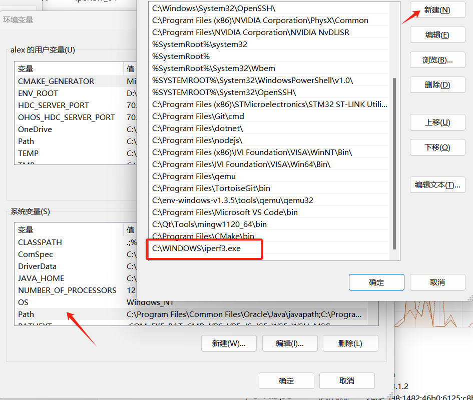

# 安装

## Ubuntu

```bash
sudo apt-get install iperf3
```

## windows

- 下载

  下载地址为：[iPerf - Download iPerf3 and original iPerf pre-compiled binaries](https://iperf.fr/iperf-download.php)；下载后包括两个文件即iperf3.exe、cygwin1.dll。

- 安装

  将下载后的文件复制到C:\WINDOWS路径下。或者按住win+R后输入%systemroot%打开这个文件夹。

- 添加环境变量

  将iperf3.exe添加至环境变量。

  

  然后打开cmd命令窗口，输入iperf3相关命令即可。

# 命令

## 帮助命令

```bash
alex@alex-xiaomi:~/Desktop$ iperf3 --help
Usage: iperf3 [-s|-c host] [options]
       iperf3 [-h|--help] [-v|--version]

Server or Client:
  -p, --port      #         server port to listen on/connect to
  -f, --format   [kmgtKMGT] format to report: Kbits, Mbits, Gbits, Tbits
  -i, --interval  #         seconds between periodic throughput reports
  -F, --file name           xmit/recv the specified file
  -A, --affinity n/n,m      set CPU affinity
  -B, --bind      <host>    bind to the interface associated with the address <host>
  -V, --verbose             more detailed output
  -J, --json                output in JSON format
  --logfile f               send output to a log file
  --forceflush              force flushing output at every interval
  -d, --debug               emit debugging output
  -v, --version             show version information and quit
  -h, --help                show this message and quit
Server specific:
  -s, --server              run in server mode
  -D, --daemon              run the server as a daemon
  -I, --pidfile file        write PID file
  -1, --one-off             handle one client connection then exit
  --rsa-private-key-path    path to the RSA private key used to decrypt
                            authentication credentials
  --authorized-users-path   path to the configuration file containing user
                            credentials
Client specific:
  -c, --client    <host>    run in client mode, connecting to <host>
  --sctp                    use SCTP rather than TCP
  -X, --xbind <name>        bind SCTP association to links
  --nstreams      #         number of SCTP streams
  -u, --udp                 use UDP rather than TCP
  --connect-timeout #       timeout for control connection setup (ms)
  -b, --bitrate #[KMG][/#]  target bitrate in bits/sec (0 for unlimited)
                            (default 1 Mbit/sec for UDP, unlimited for TCP)
                            (optional slash and packet count for burst mode)
  --pacing-timer #[KMG]     set the timing for pacing, in microseconds (default 1000)
  --fq-rate #[KMG]          enable fair-queuing based socket pacing in
                            bits/sec (Linux only)
  -t, --time      #         time in seconds to transmit for (default 10 secs)
  -n, --bytes     #[KMG]    number of bytes to transmit (instead of -t)
  -k, --blockcount #[KMG]   number of blocks (packets) to transmit (instead of -t or -n)
  -l, --length    #[KMG]    length of buffer to read or write
                            (default 128 KB for TCP, dynamic or 1460 for UDP)
  --cport         <port>    bind to a specific client port (TCP and UDP, default: ephemeral port)
  -P, --parallel  #         number of parallel client streams to run
  -R, --reverse             run in reverse mode (server sends, client receives)
  --bidir                   run in bidirectional mode.
                            Client and server send and receive data.
  -w, --window    #[KMG]    set window size / socket buffer size
  -C, --congestion <algo>   set TCP congestion control algorithm (Linux and FreeBSD only)
  -M, --set-mss   #         set TCP/SCTP maximum segment size (MTU - 40 bytes)
  -N, --no-delay            set TCP/SCTP no delay, disabling Nagle's Algorithm
  -4, --version4            only use IPv4
  -6, --version6            only use IPv6
  -S, --tos N               set the IP type of service, 0-255.
                            The usual prefixes for octal and hex can be used,
                            i.e. 52, 064 and 0x34 all specify the same value.
  --dscp N or --dscp val    set the IP dscp value, either 0-63 or symbolic.
                            Numeric values can be specified in decimal,
                            octal and hex (see --tos above).
  -L, --flowlabel N         set the IPv6 flow label (only supported on Linux)
  -Z, --zerocopy            use a 'zero copy' method of sending data
  -O, --omit N              omit the first n seconds
  -T, --title str           prefix every output line with this string
  --extra-data str          data string to include in client and server JSON
  --get-server-output       get results from server
  --udp-counters-64bit      use 64-bit counters in UDP test packets
  --repeating-payload       use repeating pattern in payload, instead of
                            randomized payload (like in iperf2)
  --username                username for authentication
  --rsa-public-key-path     path to the RSA public key used to encrypt
                            authentication credentials

[KMG] indicates options that support a K/M/G suffix for kilo-, mega-, or giga-

iperf3 homepage at: https://software.es.net/iperf/
Report bugs to:     https://github.com/esnet/iperf
```

## 常用选项

-s：作为服务器端运行iperf。
-c [server]：作为客户端连接到指定的服务器端。
-i [interval]：设置报告输出的间隔时间，默认为1秒。
-p [port]：指定服务器端监听的端口，默认为5001。
-t [time]：设置测试持续的时间，默认为10秒。
-u：使用UDP协议进行测试，默认为TCP协议。
-b [bandwidth]：设置测试流量的带宽限制，仅在UDP模式下有效。
-f [format]：设置报告输出的格式，可选值为Kbits, Mbits, Gbits等，默认为Mbits。


- 在一台服务器上启动iperf服务端：

```bash
iperf -s
```

- 在另一台客户端连接到服务器进行测试：

```bash
iperf -c server_ip
```

将 server_ip替换为服务器的IP地址。

- 使用UDP协议进行测试，并设置测试时间为30秒：

```bash
iperf -u -c server_ip -t 30
```

- 使用指定端口进行测试：

```bash
iperf -c server_ip -p 5201
```

设置报告输出的间隔时间为2秒：

```bash
iperf -c server_ip -i 2
```

设置测试带宽限制为100Mbps：

```bash
iperf -u -c server_ip -b 100M
```

# 示例

## 生成特定速率网络流并测试丢包

### 服务端

```bash
iperf3 -s
```

> 如果需要指定监听端口可以通过-p参数。例如`iperf3 -s -p 5111`，注意客户端也要通过-p参数指定同样的端口才可以连接。

### 客户端-UDP推流

启动UDP客户端，生成3M网络流，测试10s，每2s打印一次。

```bash
alex@alex-xiaomi:~/Desktop$ iperf3 -u -c 127.0.0.1 -b 3M -i 2 -t 10
Connecting to host 127.0.0.1, port 5201
[  5] local 127.0.0.1 port 40924 connected to 127.0.0.1 port 5201
[ ID] Interval           Transfer     Bitrate         Total Datagrams
[  5]   0.00-2.00   sec   736 KBytes  3.01 Mbits/sec  23
[  5]   2.00-4.00   sec   736 KBytes  3.01 Mbits/sec  23
[  5]   4.00-6.00   sec   736 KBytes  3.01 Mbits/sec  23
[  5]   6.00-8.00   sec   736 KBytes  3.02 Mbits/sec  23
[  5]   8.00-10.00  sec   736 KBytes  3.01 Mbits/sec  23
- - - - - - - - - - - - - - - - - - - - - - - - -
[ ID] Interval           Transfer     Bitrate         Jitter    Lost/Total Datagrams
[  5]   0.00-10.00  sec  3.59 MBytes  3.01 Mbits/sec  0.000 ms  0/115 (0%)  sender
[  5]   0.00-10.05  sec  3.59 MBytes  3.00 Mbits/sec  0.017 ms  0/115 (0%)  receiver

iperf Done.
```

### 客户端-TCP推流

```bash
$ iperf3 -c 127.0.0.1 -b 3M -i 2 -t 10
```


## 记录到文件

```bash
$ iperf -c 192.168.1.180 -u -b 20M > test.txt
```


# 注意事项

## windows与linux使用 iperf注意事项

windows与linux使用iperf打流时，需要增加-w的参数，否则会影响测试的吞吐量

另外iperf3, server端直接-s即可，无需增加额外的参数

```bash
iperf3 -s
```

如果想增加-w的参数，只在client端增加即可

```bash
iperf3 -c 192.168.0.100 -w 16M -i 1 -P 5 -B 192.168.0.10 -t 10
```


