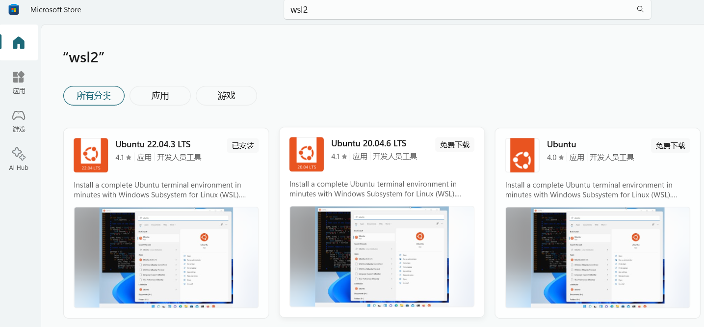
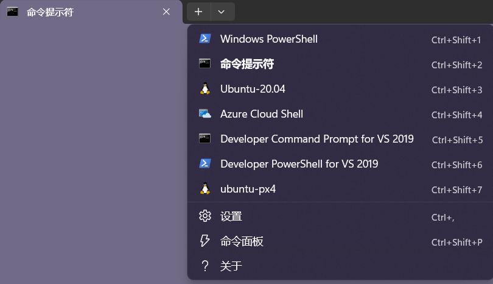
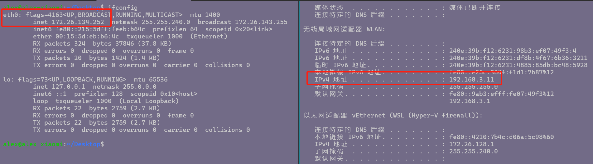
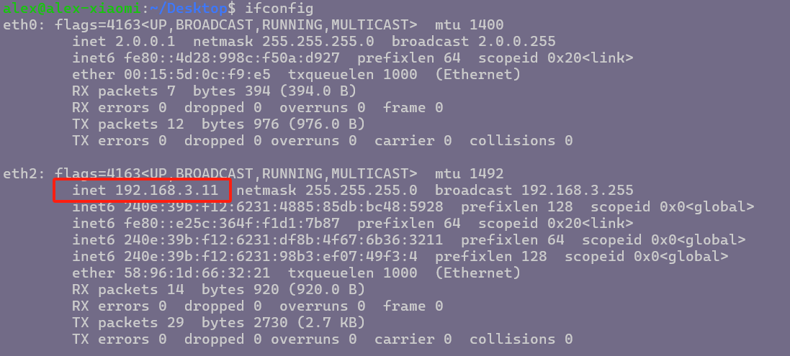
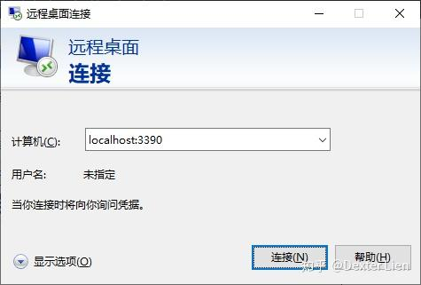

# WSL2笔记

## 简介

这里以Windows11为例记录WSL2的使用。

系统版本信息

- 版本：Windows 11 家庭中文版
- 版本号：23H2

参考官方资料：

https://learn.microsoft.com/zh-cn/windows/wsl/install

https://learn.microsoft.com/zh-cn/windows/wsl/wsl-config

## 安装

### 安装WSL2

请参考官网教程：https://docs.microsoft.com/zh-cn/windows/wsl/install-manual

#### 步骤 1 - 启用适用于 Linux 的 Windows 子系统

以管理员方式打开Windows PowerShell，输入如下命令：

```shell
dism.exe /online /enable-feature /featurename:Microsoft-Windows-Subsystem-Linux /all /norestart
```

#### 步骤 2 - 检查运行 WSL 2 的要求

如果是 Windows 11系统则默认支持WSL2。

如果Windows 10系统，则有如下要求：

- 对于 x64 系统：版本 1903 或更高版本，内部版本为 18362.1049 或更高版本。
- 对于 ARM64 系统：版本 2004 或更高版本，内部版本为 19041 或更高版本。

#### 步骤 3 - 启用虚拟机功能

在Windows PowerShell，输入如下命令：

```shell
dism.exe /online /enable-feature /featurename:VirtualMachinePlatform /all /norestart
```

重启计算机。

#### 步骤 4 - 下载 Linux 内核更新包

下载最新包：

- [适用于 x64 计算机的 WSL2 Linux 内核更新包](https://wslstorestorage.blob.core.windows.net/wslblob/wsl_update_x64.msi)
- 运行上一步中下载的更新包。 （双击以运行 - 系统将提示你提供提升的权限，选择“是”以批准此安装。）

#### 步骤 5 - 将 WSL 2 设置为默认版本

```shell
wsl --set-default-version 2
```

#### 步骤 6 - 安装所选的 Linux 分发

##### 通过应用商店

1. 打开 [Microsoft Store](https://aka.ms/wslstore)，并选择你偏好的 Linux 分发版。

2. 在分发版的页面中，根据需要版本点击右上角的“获取”。

   

   安装完成后再次点击打开即可。

3. 首次启动新安装的 Linux 分发版时，将打开一个控制台窗口，系统会要求你等待一分钟或两分钟，以便文件解压缩并存储到电脑上。 未来的所有启动时间应不到一秒。

   然后，需要[为新的 Linux 分发版创建用户帐户和密码](https://learn.microsoft.com/zh-cn/windows/wsl/setup/environment#set-up-your-linux-username-and-password)。

##### 通过命令行

查看可用的分发版：

```bash
wsl --list --online
```

> 如下：
>
> ```bash
> C:\Users\alex>wsl --list --online
> 以下是可安装的有效分发的列表。
> 使用 'wsl.exe --install <Distro>' 安装。
> 
> NAME                                   FRIENDLY NAME
> Ubuntu                                 Ubuntu
> Debian                                 Debian GNU/Linux
> kali-linux                             Kali Linux Rolling
> Ubuntu-18.04                           Ubuntu 18.04 LTS
> Ubuntu-20.04                           Ubuntu 20.04 LTS
> Ubuntu-22.04                           Ubuntu 22.04 LTS
> Ubuntu-24.04                           Ubuntu 24.04 LTS
> OracleLinux_7_9                        Oracle Linux 7.9
> OracleLinux_8_7                        Oracle Linux 8.7
> OracleLinux_9_1                        Oracle Linux 9.1
> openSUSE-Leap-15.6                     openSUSE Leap 15.6
> SUSE-Linux-Enterprise-15-SP5           SUSE Linux Enterprise 15 SP5
> SUSE-Linux-Enterprise-Server-15-SP6    SUSE Linux Enterprise Server 15 SP6
> openSUSE-Tumbleweed                    openSUSE Tumbleweed
> ```
>
> **如果显示无法连接服务器，可以在hosts下增加：**
>
> ```bash
> 185.199.108.133 raw.githubusercontent.com   
> ```

然后下载安装

```bash
wsl --install Ubuntu-20.04 --web-download
```


> 安装的默认位置是：
>
> C:\Users\alex\AppData\Local\Packages\CanonicalGroupLimited.UbuntuonWindows_79rhkp1fndgsc\LocalState\ext4.vhdx

### 安装Windows终端

Windows终端用于管理所有的终端如cmd、Windows PowerShell、WSL，交互性较好。该终端相当于一个“各终端集合”，就能够快速打开各类终端：



请参考官网教程：https://docs.microsoft.com/zh-CN/windows/terminal/install

### Win11下应用界面 配置
如果是在win11系统下安装wsl2，则可以直接打开Linux下的桌面应用并在Windows下显示。
参考：https://learn.microsoft.com/zh-cn/windows/wsl/tutorials/gui-apps

- 安装
安装完wsl后，打开powershell（管理员身份运行）：
```shell
wsl --update    #通过update更新到包含Linux GUI支持的最新版本

wsl --shutdown  #需要重启wsl，关闭后，通过Windows terminal再次打开Ubuntu即可
```
- 测试
打开Ubuntu终端，输入`gedit`即可弹出文本编辑界面。

## 常用命令

### 查看

列出当前已安装的Linux

```bash
wsl --list --verbose
#或者
wsl -l -v
```

显示结果如下：

```bash
C:\Users\alex>wsl --list --verbose
  NAME            STATE           VERSION
* Ubuntu-20.04    Stopped         2
```

### 启动/停止

#### 启动

有如下几种启动方式：

- 通过Windows Shell选择启动的分发版；
- 通过`wsl --distribution <分发版名称> `命令；

#### 停止

- 通过命令`wsl -t <分发版名称>`，停止特定分发版的运行；
- 通过命令`wsl --shutdown`停止所有分发版的运行；

注意，如果只是关闭打开的分发版终端是不会停止其运行的！！！

**WSL2有个8秒原则，如果是进行一些配置需要关机，故一定要关机后等待8秒再执行启动操作。**

### 卸载

列出当前已安装的Linux

```bash
wsl --list --verbose
```

卸载

```bash
wsl --unregister [Linux版本名称]
```

卸载速度很快，且会立即释放磁盘占用空间。

### 分发版迁移

通过导入导出功能实现Linux的备份与恢复。

#### 导出

列出当前已安装的Linux

```bash
wsl --list --verbose
```

执行导出

> 如果分发版在运行则需要先停止运行

```bash
wsl --export <Distribution Name> <FileName>
```

例如

```bash
wsl --export Ubuntu-20.04 ubuntu.tar
```

#### 导入

可将导出的备份文件再添加到WSL下。为了避免占用C盘空间，简易在D盘创建一个wsl目录专门存放系统。

命令格式如下：

```bash
wsl --import <Distribution Name> <InstallLocation> <FileName>
```

例如：

```bash
wsl --import ubuntu-alex D:\wsl2 C:\Users\alex\Desktop\ubuntu.tar
```

**迁移后的分发版启动之后往往是root用户，为了恢复原先用户，需要进行如下操作：**

- 启动分发版后，创建`/etc/wsl.conf`文件

  ```bash
  [user]
  default=alex
  [boot]
  systemd=true
  ```

  > 这里alex是迁移前就创建的默认用户名，根据情况改为你自己的用户名即可。

- 重启分发版

  ```bash
  wsl --shutdown
  ```


## 网络

### 镜像网络配置

打开Windows终端，打开Ubuntu和cmd终端窗口，分别输入`ifconfig`和`ipconfig`命令查看网络地址，如下图：



可以看到，左边Ubuntu的地址与右边Windows系统地址不在一个网段上（不在一个局域网内），那么与本机同网段的其他计算机（如：本机与其他计算机连接同一个交换机）是无法直接与Ubuntu进行通信的。

通过wsl配置文件进行网络配置，使本地网络与WSL网络配置为同一个IP。

1. 在用户根目录下创建`.wslconfig`文件；

2. 添加如下内容：

   ```bash
   [wsl2]
   networkingMode=mirrored
   ```

3. 先关闭wsl，在Windows终端输入`wsl --shutdown`;

4. 等待8秒后启动Ubuntu。

再次查看Ubuntu网络地址，如下：



可以看到，Ubuntu与Windows的IP地址一样了。

### 端口映射

#### 原理

##### 通过netsh配置

参考：https://zhuanlan.zhihu.com/p/357038111

```html
netsh winsock reset
```

##### netsh使用

- 新增端口转发

```bash
netsh interface portproxy add v4tov4 listenaddress=监听地址 listenport=监听端口 connectaddress=转发到的地址 connectport=转发到的端口
#例如新增外部ssh访问转发至本机的WSL2：
netsh interface portproxy add v4tov4 listenaddress=127.0.0.1 listenport=22 connectaddress=wsl2ip connectport=22
```

- 查看设置了哪些端口转发

```bash
netsh interface portproxy show all
```

- 删除转发规则

```bash 
netsh interface portproxy delete v4tov4 listenaddress=192.168.88.110 listenport=9988
```

> Note:
>
> **使用netsh interface portproxy记得配置Windows和出口路由器防火墙规则**

#### 创建端口转发

##### 查看IP

##### 示例

新增端口转发：转发主机14550至WSL2的14550端口。

```shell
#1）使用localhost
$ netsh interface portproxy add v4tov4 listenport=14550 listenaddress=0.0.0.0 connectport=14550 connectaddress=localhost

#2）如果不用localhost，则查看WSL VM的ip地址，例如为192.168.208.1
$ netsh interface portproxy add v4tov4 listenport=14550 listenaddress=0.0.0.0 connectport=14550 connectaddress=192.168.215.89
```

> 在18945之后的版本中, 微软改进了WSL2, 使我们可以使用localhost, 访问WSL的网络服务

## 开机启动

```shell
sudo cat > /etc/init.wsl << EOF
#!/bin/sh
/etc/init.d/ssh start
/etc/init.d/nginx start
EOF

sudo chmod +x /etc/init.wsl
```


## WSL桌面

### 使用XLaunch+xfce4

#### Windows下安装和配置XLaunch

- 下载并安装[VcXsrv](https://sourceforge.net/projects/vcxsrv/)

安装完成后，在桌面生成XLaunch快捷方式

- 运行XLaunch

双击XLaunch快捷方式启动，选择默认配置即可，在设置页面中输入**-ac**，如下图所示：


启动完成后，会弹出一个黑框，这是因为桌面服务还没有启动，需要在Ubuntu中进行xfce4服务启动。

#### Ubuntu下安装和配置xfce4

- 安装

输入如下命令安装，选择默认配置即可。

```shell
$ sudo apt update
$ sudo apt install xfce4
```

- 配置环境变量

  Windows下打开PowerShell，输入`ipconfig`，获取WSL对应的IP，如下图所示：


然后在Ubuntu下，在`~/.bashrc`文件末尾添加：

```shell
export DISPLAY=<WSL的IP>:0     #例如我的配置为 export DISPLAY=172.24.48.1:0
```

- 启动xfce4

```SHELL
$ startxfce4
```


启动后，Windows界面中的XLaunch黑框，就会显示Ubuntu界面。


### 使用xrdp实现远程桌面

使用xrdp+xfce4进行远程桌面访问。

#### 安装相关软件包

```shell
$ sudo apt update
$ sudo apt install -y xfce4 xrdp
```

> Note:
>
> 安装xfce4过程中会出现选择显示管理DM选择的提示,建议用`lightdm`
>
> 如果错过了安装过程中出现的这个向导,那么可以在安装完成后执行下面的命令重新设置DM
>
> ```bash
> $ sudo dpkg-reconfigure lightdm
> ```

#### 修改xrdp默认端口

由于`xrdp`安装好后默认配置使用的是和Windows远程桌面相同的`3389` 端口,为了防止和Windows系统远程桌面冲突,建议修改成其他的端口

```bash
$ sudo vim /etc/xrdp/xrdp.ini
# 修改下面这一行,将默认的3389改成其他端口即可
port=3390
```

#### 为当前用户指定登录session类型

**注意这一步很重要,如果不设置的话会导致后面远程桌面连接上闪退**

```bash
$ vim ~/.xsession

# 写入下面内容(就一行)
xfce4-session
```

#### 启动xrdp

由于WSL2里面不能用`systemd`,所以需要手动启动

```bash
$ sudo /etc/init.d/xrdp start
```

#### 远程访问

在Windows系统中运行`mstsc`命令打开远程桌面连接,地址输入`localhost:3390`

注意这里的端口号应当与上面修改配置中一致



输入WSL2中使用的账号密码即可。
