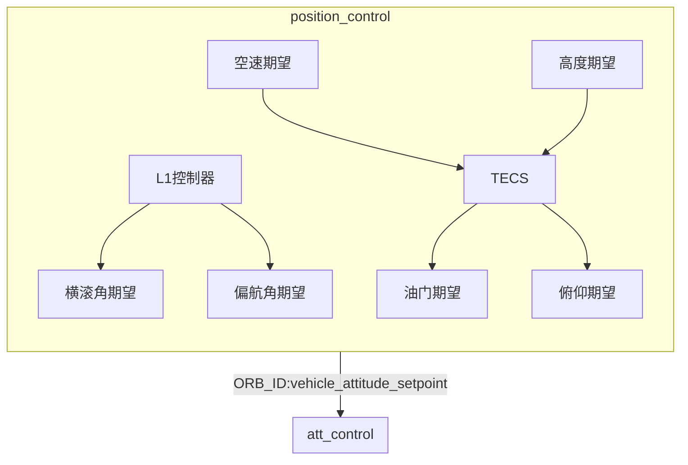
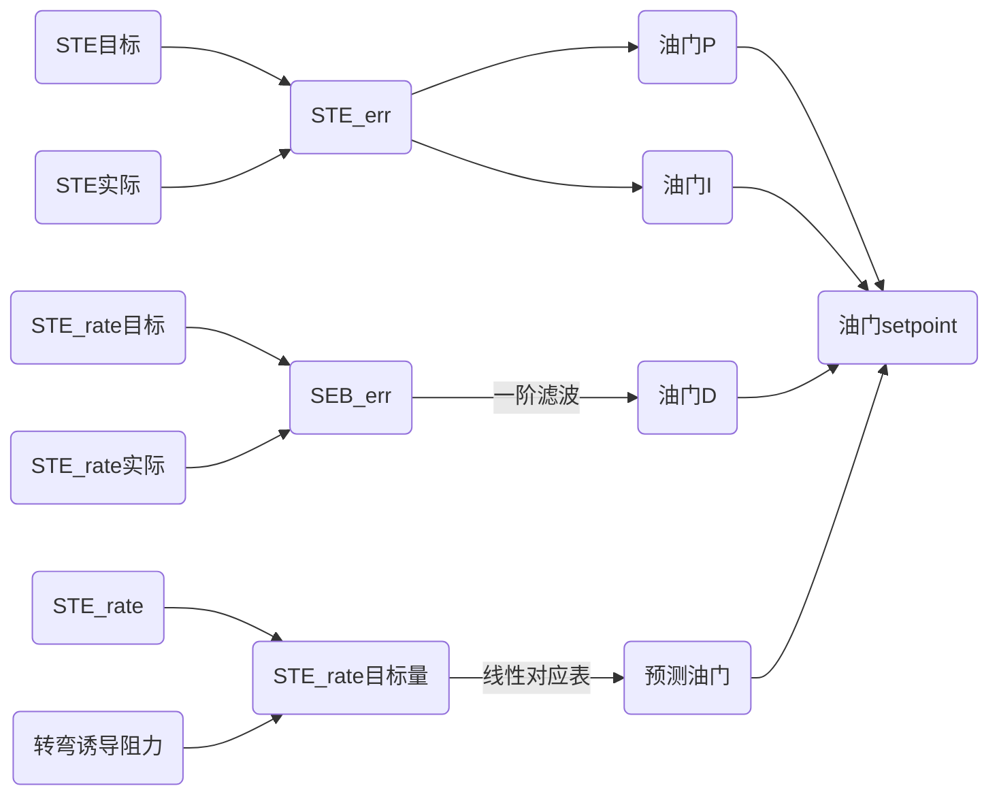

# 绘图

## mermaid

### 示例1

```mermaid
flowchart TB
subgraph position_control
	direction TB
    L1控制器-->横滚角期望
    L1控制器-->偏航角期望
	
    空速期望-->TECS[TECS]
    高度期望-->TECS
    TECS-->油门期望
    TECS-->俯仰期望
end

subgraph att_control
	
end
position_control -- ORB_ID:vehicle_attitude_setpoint --> att_control
```

### 示例2

```mermaid
graph LR
STE_sp(STE目标)-->STE_err(STE_err)-->throttle_P(油门P)-->out(油门setpoint)
STE(STE实际)-->STE_err-->throttle_I(油门I)-->out

STE_rate_sp(STE_rate目标)-->STE_rate_err(SEB_err)--一阶滤波-->throttle_D(油门D)-->out
STE_rate(STE_rate实际)-->STE_rate_err

STE_rate_t(STE_rate)-->STE_rate_target(STE_rate目标量)--线性对应表-->throttle_predict(预测油门)-->out
f(转弯诱导阻力)-->STE_rate_target
```

