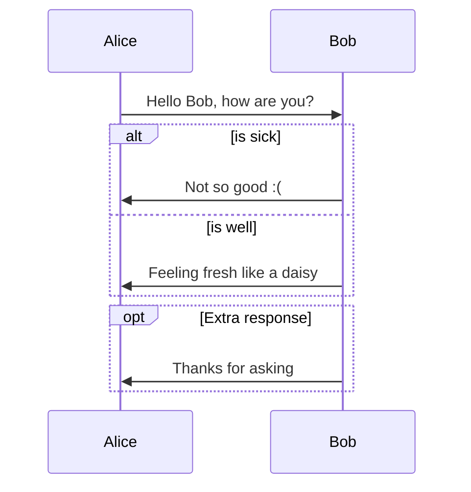
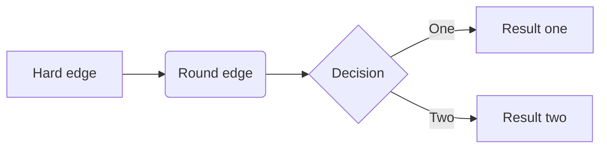
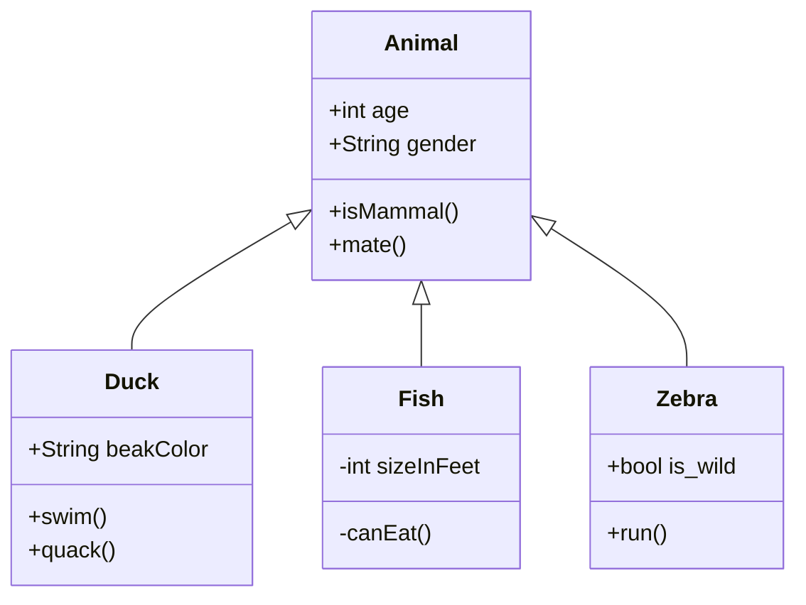
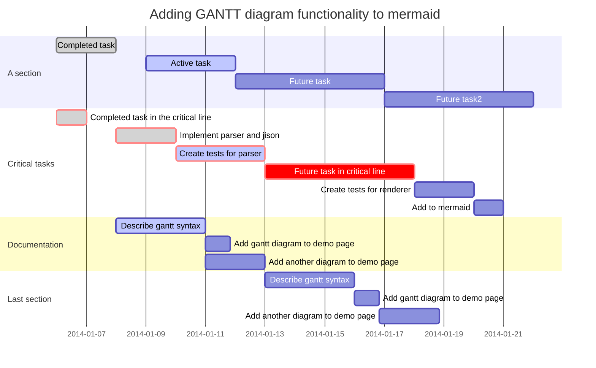

# markdown

## 公式

### 公式序号

在typora文件菜单中选择偏好设置，在markdown->公式中勾选自动添加序号。

### 添加公式标号

在公式后面通过`\label{}`添加标号。例如：
$$
F=ma
\label{eq_force}
$$

### 公式引用

通过`\refeq{}`对公式引用。例如：

式$\refeq{eq_force}$描述了力与加速度的关系。

### 对齐

$$
\begin{align}
\begin{pmatrix}
t \\
p
\end{pmatrix} &=
\begin{bmatrix}
m1 & n1 \\
m2 & n2 \\
\end{bmatrix}*
\begin{pmatrix}
h \\
v
\end{pmatrix}\\ &=
A*
\begin{pmatrix}
h \\
v
\end{pmatrix}
\end{align}
$$

 

## 格式

### 分页

#### 强制分页

可以通过HTML语句实现分页：

```html
<div style="page-break-after: always; break-after: page;"></div>
```

导出PDF就会看到分页效果。

**现在开始分页！！！**

<div style="page-break-after: always; break-after: page;"></div>

**新的一页开始啦！！！**


</div>
## 绘图

### 序列图（Sequence Diagrams）

这个功能使用 [js-sequence (opens new window)](https://bramp.github.io/js-sequence-diagrams/)，它把下面的代码块渲染成一个图表。

```sequence
Alice->Bob: Hello Bob, how are you?
Note right of Bob: Bob thinks
Bob-->Alice: I am good thanks!
```


### 流程图

这个功能使用[flowchart.js (opens new window)](http://flowchart.js.org/)，它将以下代码块变成了一个渲染的图表。

```flow
st=>start: Start
op=>operation: Your Operation
cond=>condition: Yes or No?
e=>end

st->op->cond
cond(yes)->e
cond(no)->op
```


### mermaid

#### 序列图




#### 流程图



#### 类图

更多细节见[这些说明 (opens new window)](https://mermaid-js.github.io/mermaid/#/classDiagram)。



#### 甘特图



