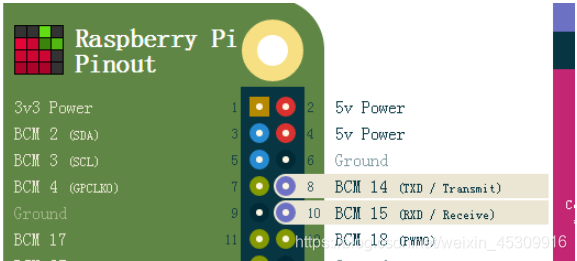
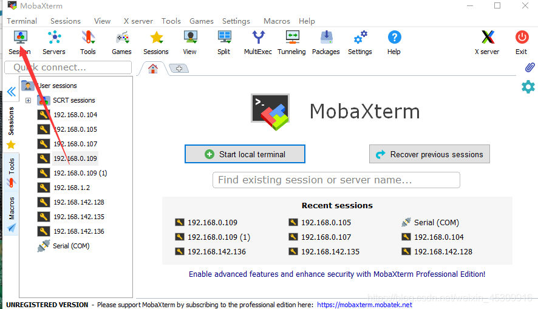

# 树莓派配置手册

该手册针对树莓派3B/3B+

## 系统安装

### 通过Raspberry Pi Imager软件安装

### 通过下载镜像安装

https://www.raspberrypi.com/software/operating-systems/

选择合适的镜像版本下载，得到如`2022-04-04-raspios-bullseye-arm64.img.xz`的压缩包，解压后得到`2022-04-04-raspios-bullseye-arm64.img`文件。

> 注意下载的镜像版本，树莓派Raspbian镜像各版本都有对应的名字，在下载的镜像文件例如2022-04-04-raspios-bullseye-arm64.img，可以找到其对应的名字为**bullseye**，这个镜像版本名称在进行后续配置时可能会用到。

## 系统备份方法

### 使用Win32 Disk Imager

1. 下载Win32 Disk Imager 安装在Windows计算机上并打开，将做好系统的SD插入读卡器后，插入计算机。

2.  新建一个backup.img文件
3.  Win32 Disk Imager选择新建的backup.img文件，点击Read，即可将做好的系统备份到backup.img文件中。

优点：可备份为.img文件，可以批量生产树莓派系统了。

缺点：该backup.img的大小与SD卡大小一模一样，后续将backup.img烧写到新的SD卡时要求新SD容量比.img镜像文件大。

### 使用Raspbian系统SD Card copier

1. 打开SD Card copier
2. copy from选择（/dev/mmcblk0）的选项， copy to Device 选择目标的sd。
3. 点击开始，克隆过程大概10-15分钟

优点：

1. 无需输入命令，速度快。
2. 无容量限制，无需扩容，可以克隆到任意大小的SD上，前提是目标SD能装下系统。

**备注：**树莓派识别NTFS格式的SD卡，请先将SD卡格式化(Windows->右键->格式化)时选择file system=NTFS。

### 使用dd命令

这个方法对所有系统都可用，不论raspbian还是ubuntu。

#### 镜像备份

1. 将树莓派内存卡取下插到ubuntu系统计算机上；

2. 在ubuntu系统计算机运行命令`df -h`查看分区，一般来说/dev/sdb1和/dev/sdb2是树莓派的系统分区；

3. 使用dd命令将树莓派内存卡内的系统备份至本地：

   ```bash
   #opt1:备份系统到本地镜像文件
   sudo dd if=/dev/sdb of=/home/alex/Desktop/raspberry_ros.img
   #opt2:备份系统到本地压缩镜像文件
   sudo dd if=/dev/sdb | gzip>/home/alex/Desktop/raspberry_ros.img.xz
   ```

4. 备份过程中没有进度条，耐心等待；

5. 得到img文件后，也可使用dd命令烧写至一个新的SD卡中

   1）可以通过dd命令进行烧写：

   ```bash
   # 使用镜像文件制作
   sudo dd if=raspberry_ros.img of=/dev/sdb`
   # 使用压缩镜像文件制作
   gzip -c -d ghost_linux_latelee.img.gz | dd of=/dev/sda
   ```

   2）也可以将镜像文件（非压缩）使用WinDiskImager进行烧写（推荐）。

#### 系统拷贝

可以使用dd命令将树莓派系统直接拷贝至SD卡中，打开树莓派后，插入格式化的SD卡，然后在树莓派运行命令：

```bash
$ sudo dd bs=4m if=/dev/mmcblk0 of=/dev/sda
```

拷贝完成后（拷贝过程很长，可能一个多小时），将新卡插入树莓派启动即可。

## 树莓派默认用户名密码

默认用户名为:pi

默认密码为：raspberry

> 注意：
>
> 对于最新的系统，由于pi用户的安全问题，无法ssh登录。解决方法：
>
> 1. 使用Raspberry Pi Imager烧写系统时，在高级设置中启用pi用户；
>
> 2. 在烧写后的SD目录下，创建userconf文件，并输入如下内容：
>
>    ```shell
>    pi:$6$/4.VdYgDm7RJ0qM1$FwXCeQgDKkqrOU3RIRuDSKpauAbBvP11msq9X58c8Que2l1Dwq3vdJMgiZlQSbEXGaY5esVHGBNbCxKLVNqZW1
>    ```

## 无屏配置

本方法适用很多时候没有显示屏，进行树莓派访问和设置。

参考：https://www.cnblogs.com/dongxiaodong/p/9708760.html

https://shumeipai.nxez.com/2017/09/13/raspberry-pi-network-configuration-before-boot.html

### WIFI

系统烧写到SD卡后，在windows文件浏览器打开SD卡，可看到SD卡对应的盘符是boot，在根目录下新建文件:**wpa_supplicant.conf **

然后添加如下内容：

```
country=CN
ctrl_interface=DIR=/var/run/wpa_supplicant GROUP=netdev
update_config=1
 
network={
ssid="WiFi-A"
psk="12345678"
key_mgmt=WPA-PSK
priority=1
}
```

### ssh

在SD卡根目录下新建**ssh**文件，不用填写后缀和内容。开机后通过某些手段获取树莓派IP后，即可通过如下命令进行远程连接：

```
ssh pi@192.168.1.xxx  
#密码是raspberry
```

可以Windows安装git，使用git Bash进行ssh。

远程连接后，输入exit是退出ssh。

### 全网段ping

如果树莓派已经连接WIFI或路由器，你可以通过全网段ping，找出丢包为0%的IP地址，这些IP地址基本上就是潜在的树莓派地址。

```
FOR /L %I in (1,1,255) DO PING 192.168.3.%I -n 1 -w 100
```

### 串口登录

1. 修改配置文件

SD卡烧录系统后，在SD卡根目录下修改两个配置文件：comline.txt、config.txt。

- comline.txt

  将如下添加到文件最后

  ```shell
  dtoverlay=pi3-miniuart-bt
  ```

- config.txt

  并且使用如下内容进行替换。最好先对对该文件进行备份。

  ```shell
  dwc_otg.lpm_enable=0 console=tty1 console=serial0,115200 root=/dev/mmcblk0p2 rootfstype=ext4 elevator=deadline fsck.repair=yes rootwait
  ```

2. 硬件连接

   

3. 登录

   使用mobaXterm，建立串口连接并登录。

   

   

## 键盘配置

start->Preferences->Mouse and keyboard Settings->Keyboard

点击Keyboard Layout配置如下:

Model >> Generic  104-key PC

Layout>> Chinese

Variant>> Chinese

## 接口配置

start->Preferences->Raspberry Pi Configuration->Interfaces

将所有接口选择Enable

## 用户

```sh
groups pi
sudo usermod -a -G dialout pi
```

## 国内镜像源

阿里云：https://developer.aliyun.com/mirror/raspbian/?spm=a2c6h.25603864.0.0.4508153503kmsF

清华源：https://mirrors.tuna.tsinghua.edu.cn/help/raspbian/

### wheezy版本系统

- 确保网络连接正常
- 编辑/etc/apt/sources.list，修改为如下

```shell
deb http://mirrors.tuna.tsinghua.edu.cn/raspbian/raspbian/ wheezy main contrib non-free

deb-src http://mirrors.tuna.tsinghua.edu.cn/raspbian/raspbian/ wheezy main contrib non-free
```

- 更新

```shell
$ sudo apt update
$ sudo apt upgrade
```

### bullseye版本系统

- 编辑/etc/apt/sources.list

```shell
deb http://mirrors.aliyun.com/raspbian/raspbian/ bullseye main non-free contrib
deb-src http://mirrors.aliyun.com/raspbian/raspbian/ bullseye main non-free contrib
```

- 编辑/etc/apt/sources.list.d/raspi.list

```shell
deb http://mirrors.aliyun.com/raspberrypi/ bullseye main ui
```

- 添加公钥

```shell
$ gpg --keyserver  keyserver.ubuntu.com --recv-keys 9165938D90FDDD2E
$ gpg --export --armor  9165938D90FDDD2E | sudo apt-key add -
```

- 更新

```shell
$ sudo apt update    
$ sudo apt upgrade
```


## 网络设置

### 设置静态IP

我们通过编辑`/etc/dhcpcd.conf`配置文件来进行IP静态绑定。

```
$ sudo vi /etc/dhcpcd.conf
```

对于无线网卡，在底部添加：

```
interface wlan0 #网卡名
inform 192.168.1.100/24                # 树莓派IP
static routers=192.168.1.1	           # 路由器IP
static domain_name_servers=192.168.1.1 #DNS,也是路由IP
```

对于有线网卡：

```
interface eth0 # 网卡名
static ip_address=192.168.1.100/24     # 树莓派IP
static routers=192.168.1.1	           # 路由器IP
static domain_name_servers=192.168.1.1 #DNS,也是路由IP
```

### WiFi操作

```
sudo ifdown wlan0  #关闭WiFi
sudo ifup wlan0     #打开WiFi
ifconfig wlan0 #查看是否连接网络（有inet addr地址则说明连接上）
```

### 添加WiFi网络

如果希望开机启动就自动连接一个新的WiFi，则编辑`/etc/wpa_supplicant/wpa_supplicant.conf`，在文件底部添加：

```
network={
		ssid="alex"
		psk="12345678"
}
```


### 彻底关闭WiFi

在文件`/boot/config.txt`后追加：

```
dtoverlay=pi3-disable-wifi
```


## 树莓派WiFi热点

### 安装create_ap

基于GitHub开源项目：https://github.com/oblique/create_ap

1. 下载create_ap

   $ git clone https://github.com/oblique/create_ap

2. 安装

   $ cd create_ap

   $ sudo make install

3. 安装依赖包

   $ sudo apt-get install util-linux procps iproute2 iw haveged dnsmasq hostapd 

4. 测试使用

   $ sudo create_ap wlan0 eth0 boolpi 12345678

5. 设置开机启动

   打开/etc/rc.local，末尾exit 0之前添加sudo create_ap wlan0 eth0 boolpi 12345678

6. 在重启前关闭连接的WiFi，重启后即可出现热点。

### 问题

1. 有时候hostapd安装时出现版本冲突问题，使用sudo aptitude install hostapd，根据提示进行版本调整即可。
2. 测试时确保树莓派没有连接任何WiFi！不然无法创建热点
3. 设置的密码一定要不少于8位！
4. 如果还需要安装**远程桌面**，在添加开机启动时，一定要将远程桌面放到前面，然后再打开热点。

## 远程桌面

1. 安装必要软件

   $ sudo apt-get install tightvncserver xrdp

2. 开机启动

   $ sudo vi /etc/rc.local

   在文件末尾，exit 0前添加sudo /etc/init.d/xrdp start

   

## 文件共享

树莓派端：（参考接口配置）开启ssh

Windows端：安装winscp

保证树莓派与Windows在同一个局域网内，打开winscp输入树莓派IP。


### copy local file to remote

```
$ scp -r  ./Desktop/beihang_flocking ubuntu@192.168.43.200:/home/ubuntu
```

### copy remote file to local

```
$ scp -r ubuntu@192.168.43.200:/home/ubuntu/beihang_flocking ./Desktop
```

## 硬件外设

### 串口

参考：https://blog.csdn.net/huyongfu2004/article/details/123629957

测试

```shell

rpi@ubuntu:~$ python3
Python 3.9.7 (default, Sep 10 2021, 14:59:43) 
[GCC 11.2.0] on linux
Type "help", "copyright", "credits" or "license" for more information.
>>> import serial
>>> uart2 = serial.Serial(port="/dev/ttyAMA1", baudrate=9600)
>>> uart2.write("Hello World".encode("gbk"))
11
>>> uart2.read(11)
b'Hello World'
```


## 开机自启动

### 在/etc/rc.local文件中添加命令

打开/etc/rc.local（使用sudo打开），这个代码在计算机启动时执行exit 0之前的命令，这里的命令就是终端里面运行一些服务和程序的命令。

如果需要开机启动某些程序，可以现在终端窗口输入命令确保这些命令运行没有问题，然后在/etc/rc.local文件中添加一模一样的就行了。

### 在/etc/init.d目录下添加服务脚本

在终端输入如下命令

```
pi@raspberry:~ $ sudo nano /etc/init.d/testboot
```

然后可以按照以下模板添加

```python
#!/bin/sh
#/etc/init.d/testboot
### BEGIN INIT INFO
# Provides:testboot
# Required-Start:$remote_fs $syslog
# Required-Stop:$remote_fs $syslog
# Default-Start:2 3 4 5
# Default-Stop:0 1 6
# Short-Description: testboot
# Description: This service is used to start my applaction
### END INIT INFO
case "$1" in
     start)
     echo "start your app here."
     su pi -c "exec ~/testboot.sh"
     ;;
     stop)
     echo "stop your app here."
     ;;
     *)
     echo "Usage: service testboot start|stop"
     exit 1
     ;;
esac
exit 0
```


## 各类开发环境配置

### python版本

显示当前所有的Python版本

```shell
$ ls /usr/bin/python*

/usr/bin/python  /usr/bin/python2  /usr/bin/python2.7  /usr/bin/python3  /usr/bin/python3.4  /usr/bin/python3.4m  /usr/bin/python3m
```

 显示默认的的Python

```shell
$ python --version

Python 2.7.8
```

显示当前所有python

```
pi@raspberrypi:sudo su
pi@raspberrypi:update-alternatives --list python
update-alternatives: error: no alternatives for python
```

设置python优先级

```shell
pi@raspberrypi:update-alternatives  --install /usr/bin/python python /usr/bin/python2.7 1
update-alternatives: using /usr/bin/python2.7 to provide /usr/bin/python (python) in auto mode
pi@raspberrypi:update-alternatives  --install /usr/bin/python python /usr/bin/python3.4 2
update-alternatives: using /usr/bin/python3.4 to provide /usr/bin/python (python) in auto mode
```


### 升级pip

sudo python -m pip install --upgrade pip

查看当前pip版本：

pip -V

### tensorflow

​	首先打开链接：https://github.com/lhelontra/tensorflow-on-arm/releases下载tensorflow，例如下载tensorflow-1.13.1-cp35-none-linux_armv7l.whl。然后运行：

```
sudo pip3 install tensorflow-1.13.1-cp35-none-linux_armv7l.whl
```

​	这个安装过程可能比较长，而且容易因为网络问题安装不成功。请多尝试几次。

### keras

​	安装keras之前请确保安装好tensorflow

#### 安装scipy

​	在树莓派上尝试通过pip安装但失败，选择通过源码编译安装。整个过程比较久（编译过程可能需要两个小时以上）。

1. 下载scipy文件，例如scipy-1.3.0.tar.gz（https://files.pythonhosted.org/packages/cb/97/361c8c6ceb3eb765371a702ea873ff2fe112fa40073e7d2b8199db8eb56e/scipy-1.3.0.tar.gz）
2. 使用tar -xzvf scipy-1.3.0.tar.gz将文件解压。
3. 进入文件夹scipy-1.3.0后可以按照如下步骤进行编译并安装。

https://raspberrypi.stackexchange.com/questions/8308/how-to-install-latest-scipy-version-on-raspberry-pi

```shell
step1: 安装一些依赖项

sudo apt-get install libblas-dev liblapack-dev python-dev libatlas-base-dev gfortran python-setuptools libopenblas-base libopenblas-dev 

step2: 增加一个swap空间
sudo /bin/dd if=/dev/zero of=/var/swap.1 bs=1M count=1024
sudo /sbin/mkswap /var/swap.1
sudo chmod 600 /var/swap.1
sudo /sbin/swapon /var/swap.1

step3: 编译&安装
python3 setup.py build
python3 setup.py install --user

step4: 删除swap空间
sudo swapoff /var/swap.1
sudo rm /var/swap.1
```

#### 安装keras

```
sudo pip3 install keras
```

安装完成之后，keras的默认路径是在：/home/pi/.keras

# 树莓派安装Ubuntu系统

## 系统安装与配置

### 系统下载

由于官网只提供了最新版本的下载，如果希望下载旧版本，那么可以去网站：http://old-releases.ubuntu.com/releases/下载，例如下载树莓派4对应的ubunt18.04.4 版本则可以打开网页中显示的相应文件夹即可：http://old-releases.ubuntu.com/releases/18.04.4/。

你会发现即使是ubuntu18.04版本仍然分了很多小版本，他们的名字代表的含义如下：

- server: 体积小，没有桌面
- armhf: 32-bit
- arm64: 64-bit

注意：

1、树莓派4有4GB内存版本和8GB内存版本，其中4GB内存版本只能安装32bit系统，即armhf版本，而8GB内存版本可以安装64bit系统及arm64版本。

### 系统配置

#### 用户密码

对于server版本的系统，初次登录的Login和password都是ubuntu，登录上就要更改password，这里我统一修改为alex0610。

如果要更改密码：

```shell
$ passwd ubuntu   #其中ubuntu为用户名
输入当前密码，再输入新密码即可
```


#### 安装桌面

（1）更新系统
sudo apt-get update
sudo apt-get upgrade
（2）安装桌面环境（三个中任意选择：xubuntu-desktop、lubuntu-desktop、kubuntu-desktop）
sudo apt-get install xubuntu-desktop
（3）重启后进入系统

#### ssh配置

1. Ubuntu系统默认安装了openssh-client，可以直接在其他电脑上ssh远程登录树莓派的Ubuntu系统，如果希望启动本机ssh服务就需要安装openssh-server:

```
#查看当前是否安装ssh-server服务
$ dpkg -l | grep ssh
#安装ssh-server
$ sudo apt-get install openssh-server
```

2. 启动ssh-server

```
$ sudo /etc/init.d/ssh start
#或者
$ sudo service ssh start
```

查看是否启动成功

```
$ ps -e |grep ssh
```
#### 固定IP

使用ubuntu时注意，不同版本进行固定IP配置时修改的文件不一样。

- 16.04版及以前的Ubuntu DNS在 /etc/resolvconf/resolv.conf.d/base 文件中设置，然后再执行resolvconf -u。

- 18.04版ubuntu用netplan管理network, 在如 /etc/netplan/01-network-manager-ens33.yaml这样的文件中设置，然后再执行 sudo netplan apply

1）Ubuntu16.04-Desktop版本

终端输入**vi /etc/network/interfaces**命令编辑配置文件,增加如下内容： 

```
#loopback network interface
auto lo
iface lo inet loopback
#eth0为网卡名，有线网卡
auto eth0
iface eth0 inet static
address 192.168.1.211
netmask 255.255.255.0
gateway 192.168.1.1
dns-nameserver 8.8.8.8

#wlan0为网卡名,无线网卡
auto wlan0
iface wlan0 inet static
address 192.168.1.212
netmask 255.255.255.0
gateway 192.168.1.1
dns-nameserver 8.8.8.8
```

重启网络

```
ifconfig eth0 down
ifconfig eth0 up
```

2）Ubuntu18.04-Server版本

终端输入**vi /etc/netplan/50-cloud-init.yaml**命令编辑配置文件,修改如下内容：

```
network:
    ethernets:
        eth0:
            addresses: [192.168.1.201/24]
            dhcp4: false
            gateway4: 192.168.1.1
            nameservers:
                addresses: [192.168.1.1]
                addresses: [8.8.8.8, 114.114.114.114]
```

注意，以上冒号后面必须加空格！

应用配置：`sudo netplan apply`.

3）Ubuntu18.04-Server版本配置无线

首先需要查看网卡名字，使用`ifconfig`查不到无线网卡，你需要用`ip a`或者`ip addr show`命令查看，如果网卡名称为`wlan0`那么同样在文件**vi /etc/netplan/50-cloud-init.yaml**中更改配置如下：

```shell
network:
   version: 2
   ethernets:
       eth0:
           dhcp4: true
           optional: true
           match:
               macaddress: b8:27:eb:c6:94:8f
           set-name: eth0
   wifis:
       wlan0:
           dhcp4: true
           access-points:
               "wifi的ssid":
                   password: "wifi密码"
### 或者配置如下（固定IP）
network:
    renderer: NetworkManager
    wifis:
        wls33:                        #网卡名称，根据`ip a`命令查到的来确定
            dhcp4: false
            addresses: [192.168.18.123/24]
            gateway4: 192.168.18.1
            nameservers:
                addresses:
                - 8.8.8.8
                - 8.8.4.4
                search: []
            access-points:
                "wifi_ssid":           #WiFi热点名称，根据实际配置
                    password: "12345"  #WiFi密码，根据实际配置  
    version: 2
###
network:
   ethernets:
       eth0:
           dhcp4: true
           optional: true
    version: 2
    wifis:
        wls33:                        #网卡名称，根据`ip a`命令查到的来确定
            dhcp4: false
            addresses: [192.168.18.123/24]
            gateway4: 192.168.18.1
            nameservers:
                addresses:
                - 8.8.8.8
                - 8.8.4.4
                search: []
            access-points:
                "wifi_ssid":           #WiFi热点名称，根据实际配置
                    password: "12345"  #WiFi密码，根据实际配置  

```

配置完后进行：

```
sudo apt install wpasupplicant
sudo apt install network-manager
sudo netplan generate
sudo netplan apply

# 配置好文件之后 需要执行下面这个命令，查看配置是否有错，如果有错它会自动回滚上次正确配置
sudo netplan try
# 没错会让你按enter确认使用这些配置，然后执行这个命令来使配置生效
# 这个命令执行完重启后，需要等待配置完成，不要直接断电，耐心等一会。
sudo netplan apply
```


#### 开机自启动

首先进行配置文件修改，ssh-server配置文件位于/etc/ssh/sshd_config，在这里可以定义SSH的服务端口，默认端口是22，你可以自己定义成其他端口号，如222。把配置文件中的”PermitRootLogin without-password”加一个”#”号,把它注释掉，再增加一句”PermitRootLogin yes”。

开启ssh开机启动

```
$ sudo systemctl enable ssh
```

### 命令总结

```
-----------------------------------------
#启动ssh服务
$ sudo /etc/init.d/ssh start
#关闭ssh服务
$ sudo /etc/init.d/ssh stop
#查看服务运行状态
$ sudo service sshd status
-----------------------------------------
#开机自动启动ssh命令
sudo systemctl enable ssh
#关闭ssh开机自动启动命令
sudo systemctl disable ssh
#单次开启ssh
sudo systemctl start ssh
#单次关闭ssh
sudo systemctl stop ssh
#查看ssh是否启动，看到Active: active (running)即表示成功
sudo systemctl status ssh
-----------------------------------------
```


### 问题

1. connection reset by (server_ip) port 22

解决方法：

```
rm /etc/ssh/ssh_host_*
sudo dpkg-reconfigure openssh-server
```


# linux命令

### 文件的权限

改变boolpi文件夹内所有文件的权限为：所有人都可以rwx

```
sudo chmod -R a=rwx boolpi
```


