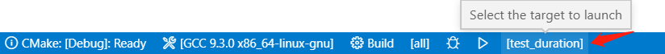

# c++开发环境配置

## 参考

[Get Started with C++ and MinGW-w64 in Visual Studio Code](https://code.visualstudio.com/docs/cpp/config-mingw)


## 代码格式化

参考：[Features for editing and navigating C++ code in VS Code such as](https://code.visualstudio.com/docs/cpp/cpp-ide)


## 调试

### 基于CMakeLists.txt调试

打开VSCode后，如果检测到CMake工程，则提示选择一个CMakeLists.txt进行编译，选择对应的CMakeLists.txt后，会在`.vscode/settings.json`中添加如下内容：

```shell
    "C_Cpp.errorSquiggles": "Enabled",
    "cmake.sourceDirectory": "${workspaceFolder}/codes_std/chrono",
```

cmake.sourceDirectory表示CMakeLists.txt所在路径，如果需要调试其他工程，对应修改即可。

当CMakeLists.txt包括多个编译目标时，可通过VSCode界面下方编译/调试工具选择要编译的目标：



### 无CMakeLists.txt调试

安装CMake、c++插件。

创建cpp文件后，按F5，选择`g++`，点击生成`launch.json`和`task.json`文件，再次按F5，即可进入调试。


## 插件

### CMake

#### 创建CMake工程

在vscode左侧插件栏点击CMake即可打开CMAKE工程目录，如果工程目录为空白，则点击`Configure All projects`，然后选择编译器即可。

>  注意，一定要先安装CMake、mingGW。


#### 编译

打开项目后，如果项目根目录下有CMakeList.txt，那么在vscode左侧插件栏点击CMake即可打开CMAKE工程目录并且看到与CMakeList.txt对应的编译目标，点击编译目标右侧的`build`图标（自动弹出对应的编译器选择提示，只需要选择mingGW编译器即可），然后即可执行相应的编译命令并生成目标（可执行文件或库文件）。

在编译中会调用`C:/mingGW/mingw32/bin/gcc.exe和g++.exe`

