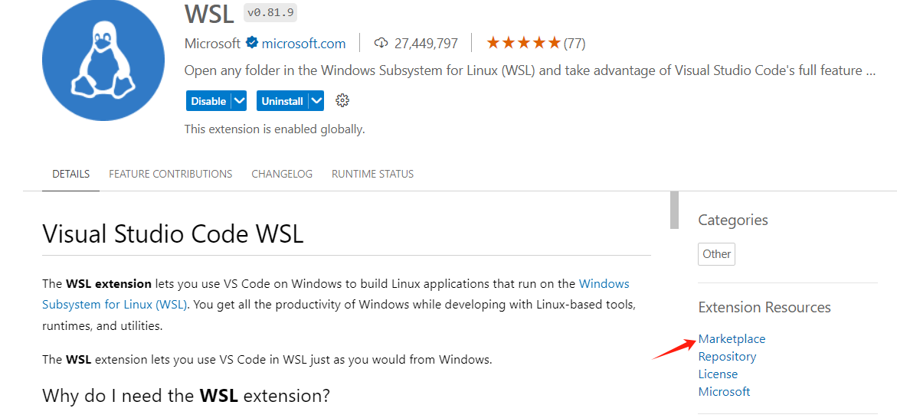
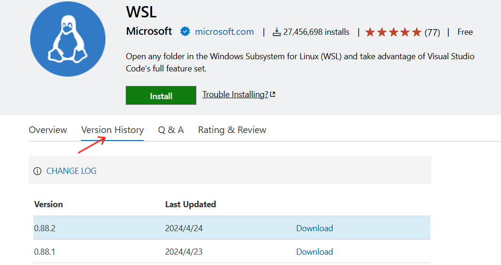
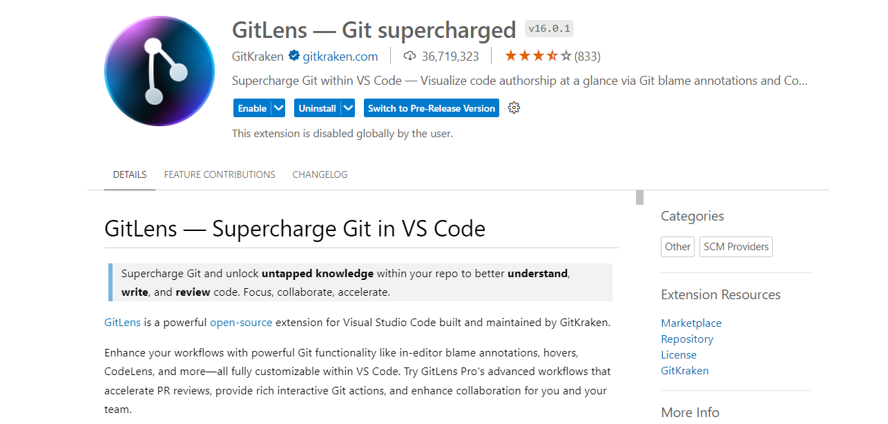
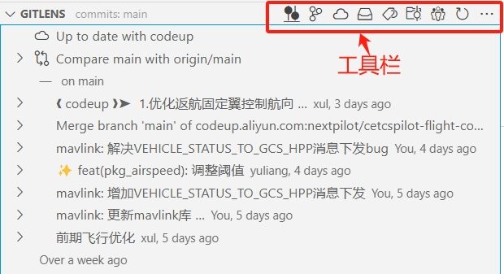
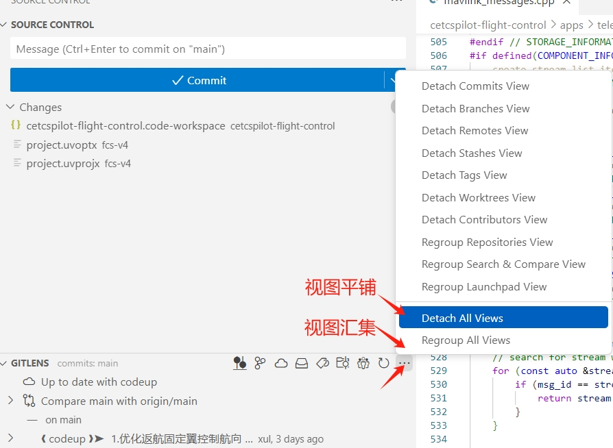
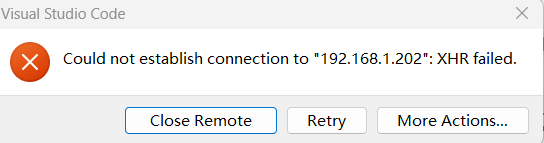
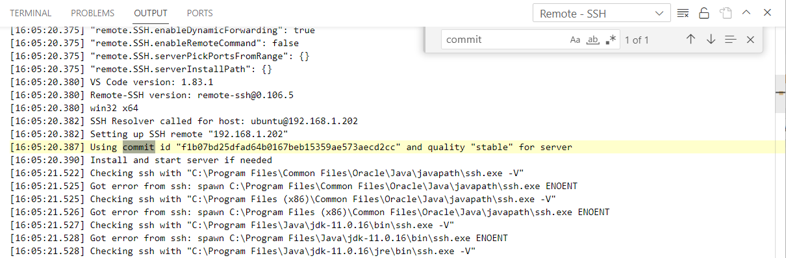

# vscode

## 基础

### 字体设置

左侧窗口

编辑属性window.zoomLevel


### settings

打开设置

- ctrl+,
- 文件->首选项->设置

#### C++智能提示

选择设置->Command Palette（快捷键ctrl+shift+P)，输入configuration，选择c/c++ Edit configuration，自动在当前目录下生成并打开c_cpp_properties.json：


在`includePath`中添加头文件路径即可！

例如我进行ROS2开发时，添加如下头文件：

```json
{
    "configurations": [
        {
            "name": "Linux",
            "includePath": [
                "/opt/ros/foxy/include",
                "/usr/include",
                "${workspaceFolder}/**"
            ],
            "defines": [],
            "compilerPath": "/opt/gcc-arm-none-eabi-9-2020-q2-update/bin/arm-none-eabi-gcc",
            "cStandard": "gnu17",
            "cppStandard": "gnu++14",
            "intelliSenseMode": "linux-gcc-arm"
        }
    ],
    "version": 4
}
```

这种方式，对于远程连接开发也是有效的。

## 快捷键

- Ctrl+D

  选择与当前光标位置所在单词的下一个单词

- Ctrl+G

  跳转至指定行

- Ctrl + \

  移动文件至分割窗口

## 插件

VS Code功能扩展依赖于大量插件。

点击左侧工具栏中的Extensions，会弹出插件列表。注意，插件分为本地Local和远端，本地代表的是当前安装VSCode的计算机，而远端一般是通过ssh远程连接的计算机，例如局域网中的另外一个电脑或者WSL2。

如果是在远端计算机上开发，一定要确保远端计算机上安装了你需要的插件，例如我当前连接WSL，插件列表如下所示：


你可以通过点击远端WSL下载图标，下载对应的插件。

### 插件安装位置

插件默认安装在用户目录下，C:\Users\alex\.vscode\extensions，该文件夹可整体拷贝并至另外的电脑实现迁移。

### 下载插件

​		VSCode提供了各插件下载链接。我们以WSL为例说明如何下载：

- 在插件工具栏中搜索WSL，点击Marketplace。



- 选择Version History，下载对应版本即可。



### 插件推荐

- gitlens

#### Remote Development

- Remote SSH
- Remote WSL
- Remote Containter

#### C++

Todo tree

Doxygen Document

### 相关插件使用

#### gitlens



插件安装完成后，默认集中显示：



可以选择平铺显示



#### koroFileheader

1. **配置**

打开设置，搜索fileheader，打开settings.json，添加如下：

```json
    "fileheader.customMade": { //此为头部注释
        "Description": "", // 文件描述
        "Version": "2.0", // 版本
        "Author": "xueyuankui", // 文件作者
        "Date": "Do not edit", // 文件创建时间(不变)
        "LastEditors": "xueyuankui", // 文件最后编辑者
        "LastEditTime": "Do not edit" // 文件最后编辑时间
    },
    "fileheader.cursorMode": { //此为函数注释
        "description":"", // 功能描述
        "param": "", // 传入参数
        "return": "", // 返回结果
        "author":"xueyuankui" // 函数作者
    }
```

2. **使用**

Ctrl + Win+i 文件头部注释快捷键

Ctrl + Win+ t 函数注释


## 代码格式化

### c/c++代码格式化设置

1. 安装c/c++、c/c++Extension Pack插件

2. 打开工作空间设置

   按`ctrl+shift+p`，输入settings，选择workspace settings，然后点击右上方进入GUI交互界面设置。这时会自动在项目目录下创建`.vscode/settings.json`配置文件。

   添加如下配置：

   ```json
     "editor.tabCompletion": "on",
     "editor.formatOnPaste": true,
     "editor.formatOnSave": true,
     "editor.formatOnType": true,
   
     // C_Cpp插件设置
     "C_Cpp.autocompleteAddParentheses": true,
     "C_Cpp.default.cppStandard": "c++11",
     "C_Cpp.default.cStandard": "c11",
     "C_Cpp.inlayHints.autoDeclarationTypes.enabled": false,
     "C_Cpp.inlayHints.autoDeclarationTypes.showOnLeft": false,
     "C_Cpp.inlayHints.parameterNames.enabled": false,
     "C_Cpp.inlayHints.referenceOperator.enabled": false,
     "C_Cpp.inlayHints.referenceOperator.showSpace": true,
     "C_Cpp.intelliSenseEngineFallback": "enabled",
     "C_Cpp.clang_format_fallbackStyle": "LLVM",
     "C_Cpp.clang_format_sortIncludes": false,
     "C_Cpp.formatting": "clangFormat",
     "C_Cpp.codeAnalysis.clangTidy.enabled": true,
     "C_Cpp.inlayHints.parameterNames.hideLeadingUnderscores": false,
   ```

## task.json文件

task.json文件中通过"tasks"数组可以添加一个或多个task成员，以逗号分隔开。

```json
{
    "tasks": [
        {
            // task-1
        },
        {
			// task-2
        }
    ],
    "version": "2.0.0"
}
```


### 运行task

快捷键`ctrl+shift+B`，如果有多个task则会弹出选择列表，鼠标点击选择对应的task即可。


## 远程连接

### 服务端无法连接

如果服务端没有联网，则无法下载vscode-server.



在终端中查找commit ID



通过浏览器下载

```bash
# 如果服务器CPU是arm
https://update.code.visualstudio.com/commit:f1b07bd25dfad64b0167beb15359ae573aecd2cc/server-linux-arm64/stable
# 如果服务器CPU是AMD/Intel
https://update.code.visualstudio.com/commit:f1b07bd25dfad64b0167beb15359ae573aecd2cc/server-linux-x64/stable
```


将文件传到服务器计算机：

```bash
scp vscode-server-linux-arm64.tar.gz ubuntu@192.168.1.202:~/.vscode-server/bin
```

放到`~/.vscode-server/bin/${commit id}`目录下：

```bash
cd ~/.vscode-server/bin/${commit id}
tar -zxf vscode-server-linux-x64.tar.gz

mv vscode-server-linux-x64/* ./
```

