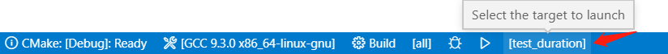

# c++开发环境配置

## 调试

### 基于CMakeLists.txt调试

打开VSCode后，如果检测到CMake工程，则提示选择一个CMakeLists.txt进行编译，选择对应的CMakeLists.txt后，会在`.vscode/settings.json`中添加如下内容：

```shell
    "C_Cpp.errorSquiggles": "Enabled",
    "cmake.sourceDirectory": "${workspaceFolder}/codes_std/chrono",
```

cmake.sourceDirectory表示CMakeLists.txt所在路径，如果需要调试其他工程，对应修改即可。

当CMakeLists.txt包括多个编译目标时，可通过VSCode界面下方编译/调试工具选择要编译的目标：



### 无CMakeLists.txt调试

安装CMake、c++插件。

创建cpp文件后，按F5，选择`g++`，点击生成`launch.json`和`task.json`文件，再次按F5，即可进入调试。