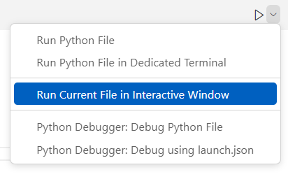
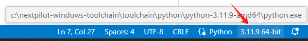
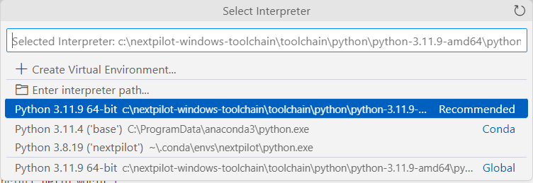

# vscode搭建python IDE

参考：[Get Started Tutorial for Python in Visual Studio Code](https://code.visualstudio.com/docs/python/python-tutorial)


## 运行

### 启动交互窗口




需要python解释器所在环境安装ipykernel包。

## 调试

### 调试方式

只调试当前文件。

通过launch.json配置调试。


### 选择编译解释器

​		在调试期间，状态栏显示当前配置和当前调试解释器。



​		开发者可以点击后选择可用的解释器。




### launch.json

```shell
{
    "version": "0.2.0",
    "configurations": [
        {
            "name": "Python Debugger: Current File",
            "type": "debugpy",
            "request": "launch",
            "python": "${command:python.interpreterPath}",
            "program": "${file}",
            "args": [
                "--a", "1",
                "--b", "2"
            ], 
            "console": "integratedTerminal",
            "justMyCode": true
        }
    ]
}
```


各配置选项解释：

> 详见：https://code.visualstudio.com/docs/python/debugging#_set-configuration-options。

- python

  设置python解释器，如果不设置则使用默认的解释器，在vscode底下状态栏会显示默认解释器。

- args

  表示传入参数，相当于python命令行运行脚本时的传参。例如`python hello.py --a 1 --b 2`。

- stopOnEntry

  如果为true，则会停在程序第一行，如果为false则会停在第一个断点处。


### 附加进程调试

```shell
tasklist | find "python"
```

